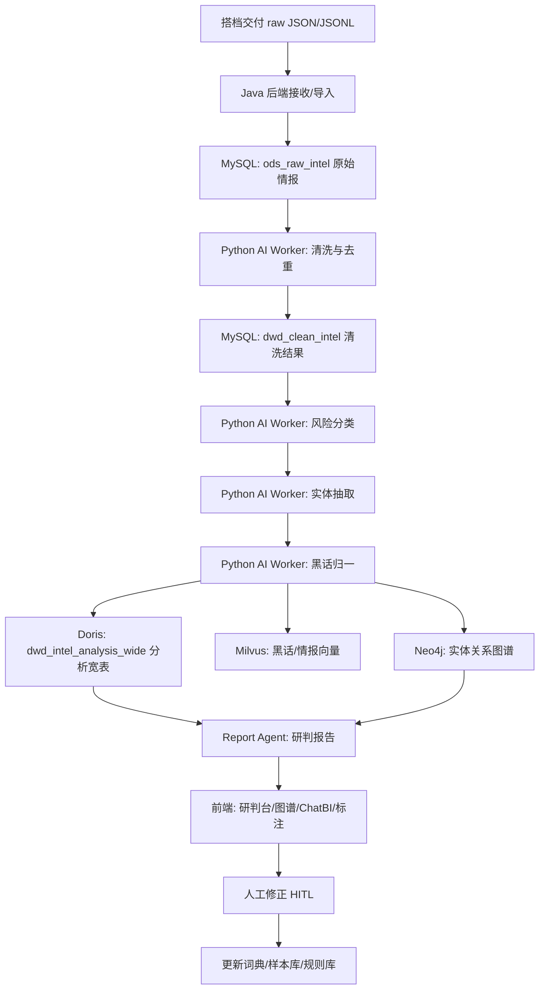
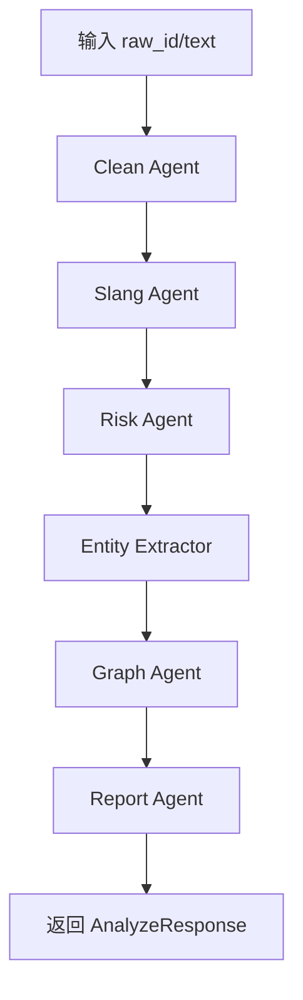

# BAGI 智能黑灰产情报研判 Agent 平台项目计划书

> 版本：v1.0  
> 目标：把多源黑灰产结构化数据，自动转化为可追溯的风险研判、实体线索、关系图谱、处置建议和训练样本。  
> 阅读对象：项目队友、后端开发、算法开发、答辩负责人。

---

## 0. 先说人话：这个项目到底要做成什么

BAGI 不是一个“会聊天的机器人”，也不是一个“爬虫展示系统”。

它最终应该是一个给安全分析员使用的 **黑灰产情报研判工作台**：

```text
输入：
  一批来自 Telegram、贴吧、知乎、微博、论坛、截图 OCR 的黑灰产情报 JSON。

系统自动做：
  1. 清洗文本
  2. 去重
  3. 判断风险类型
  4. 翻译黑话
  5. 抽取微信、QQ、手机号、链接、域名、工具名等实体
  6. 查历史数据，看这些实体是否和旧情报有关
  7. 生成图谱关系
  8. 生成可追溯研判报告
  9. 产出可用于后续训练的高质量样本

输出：
  这条情报属于什么风险、证据在哪里、涉及哪些实体、和哪些团伙有关、应该怎么处置。
```

一句话版本：

> **把黑灰产脏数据，变成可查询、可解释、可追溯、可处置的反欺诈情报。**

---

## 1. 你和搭档的职责边界

你们现在最需要先把边界划清楚，否则会互相等。

### 1.1 搭档负责：数据采集与初步清洗

搭档主要写 Python，负责把外部数据变成统一格式的 JSON。

他负责：

```text
1. 从 Telegram / 贴吧 / 知乎 / 微博 / 论坛采集数据
2. 下载图片、视频、音频等媒体资源
3. 做基础 OCR / ASR，如果来得及
4. 把数据整理成统一 raw JSON 格式
5. 按 JSONL 文件、HTTP API 或数据库表交付给你
```

搭档交付给你的最小数据格式：

```json
{
  "platform": "telegram",
  "content_raw": "抖音无人直播技术，全套教程+工具，包教包会。详情看主页，联系微信 douyin_pro888。工具下载 https://linktr.ee/douyin_pro",
  "content_type": "text",
  "source_url": "https://t.me/直播技术/24305904",
  "author_uid": "906341966",
  "author_username": "外挂脚本",
  "group_id": "直播技术",
  "collected_at": "2026-05-18T12:33:35",
  "metadata": {
    "keyword": "直播技术",
    "has_image": false,
    "has_video": false,
    "is_long_text": false,
    "message_id": 24305904
  }
}
```

### 1.2 你负责：智能体平台与研判闭环

你从结构化 JSON 开始处理，不需要亲自陷入爬虫细节。

你负责：

```text
1. 接收 raw JSON 数据
2. 入库原始情报表
3. 调用 Python AI 分析服务
4. 写入分析结果、实体、黑话、图谱、Doris 宽表
5. 提供 Spring Boot API
6. 做 ChatBI 查询与权限控制
7. 做人工标注 HITL 闭环
8. 做最终 UI 展示和答辩演示流程
```

推荐分工：

| 角色 | 技术 | 主要内容 |
|---|---|---|
| 搭档 | Python | 采集、媒体解析、基础清洗、JSON 交付 |
| 你 | Java + Python | Spring Boot 后端、数据库、Agent 调用、Doris、Neo4j、ChatBI、展示 |
| Python AI 服务 | Python FastAPI | 分类、实体抽取、黑话归一、图谱扩线、报告生成 |
| Java 后端 | Spring Boot | 任务调度、权限、接口聚合、人工审核、ChatBI 管控 |

---

## 2. 系统总流程

### 2.1 最简单理解

```text
搭档给你 raw JSON
    ↓
你保存到 ods_raw_intel
    ↓
系统清洗成 clean_text
    ↓
分类：判断它是直播违规 / 工具交易 / 引流 / 诈骗等
    ↓
抽实体：微信、URL、工具、黑话
    ↓
查图谱：这个微信或链接以前出现过没有
    ↓
写 Doris 宽表
    ↓
Agent 生成研判报告
    ↓
前端展示 + 人工修正
```

### 2.2 工程流程图



---

## 3. 用一条样例数据掰开揉碎讲完整处理过程

原始输入：

```json
{
  "platform": "telegram",
  "content_raw": "抖音无人直播技术，全套教程+工具，包教包会。详情看主页，联系微信 douyin_pro888。工具下载 https://linktr.ee/douyin_pro",
  "content_type": "text",
  "source_url": "https://t.me/直播技术/24305904",
  "author_uid": "906341966",
  "author_username": "外挂脚本",
  "group_id": "直播技术",
  "collected_at": "2026-05-18T12:33:35",
  "metadata": {
    "keyword": "直播技术",
    "has_image": false,
    "has_video": false,
    "is_long_text": false,
    "message_id": 24305904
  }
}
```

### Step 1：数据接收与原始入库

目标：先不要急着分析，先完整保存原始证据。

处理人：你这边的 Java 后端或 Python 导入脚本。

输入：

```json
{
  "platform": "telegram",
  "content_raw": "抖音无人直播技术，全套教程+工具，包教包会。详情看主页，联系微信 douyin_pro888。工具下载 https://linktr.ee/douyin_pro",
  "source_url": "https://t.me/直播技术/24305904"
}
```

处理逻辑：

```text
1. 校验必填字段：platform、content_raw、content_type、collected_at
2. 生成 raw_id，例如 10086
3. 生成 crawl_batch_id，例如 BATCH_TG_20260518_001
4. 原样保存 content_raw，不能覆盖
5. metadata 整体保存，方便回溯
```

写入表：`ods_raw_intel`

入库后的样子：

```json
{
  "id": 10086,
  "source_platform": "telegram",
  "source_channel": "直播技术",
  "source_url": "https://t.me/直播技术/24305904",
  "source_keyword": "直播技术",
  "author_id": "906341966",
  "author_name": "外挂脚本",
  "publish_time": "2026-05-18T12:33:35",
  "content_type": "text",
  "content_raw": "抖音无人直播技术，全套教程+工具，包教包会。详情看主页，联系微信 douyin_pro888。工具下载 https://linktr.ee/douyin_pro",
  "crawl_batch_id": "BATCH_TG_20260518_001",
  "raw_status": "RAW_COLLECTED"
}
```

这一层的意义：

```text
它是证据原件。后面所有判断都必须能回到 raw_id=10086。
```

---

### Step 2：媒体解析

这条样例没有图片、视频、音频，所以媒体解析跳过。

输入：

```json
{
  "raw_id": 10086,
  "content_type": "text",
  "media_urls": [],
  "metadata": {
    "has_image": false,
    "has_video": false
  }
}
```

输出：

```json
{
  "raw_id": 10086,
  "ocr_text": "",
  "asr_text": "",
  "qr_code_urls": [],
  "media_parse_status": "SKIPPED"
}
```

如果未来输入是截图，则这一步会输出：

```json
{
  "raw_id": 10087,
  "ocr_text": "招无人直播学员，包工具，联系微信 douyin_pro888",
  "asr_text": "",
  "qr_code_urls": ["https://example.com/group"]
}
```

写入表：

```text
ods_media_asset
dwd_clean_intel.ocr_text
dwd_clean_intel.asr_text
```

---

### Step 3：文本清洗

目标：把原文变成适合模型处理的文本，但不能丢掉关键线索。

输入：

```text
抖音无人直播技术，全套教程+工具，包教包会。详情看主页，联系微信 douyin_pro888。工具下载 https://linktr.ee/douyin_pro
```

处理逻辑：

```text
1. 去 HTML 标签
2. 去不可见字符
3. 统一全角/半角符号
4. 合并多余空格
5. 保留微信号、URL、数字、特殊词
6. 合并 content_raw + ocr_text + asr_text
```

输出：

```json
{
  "raw_id": 10086,
  "clean_text": "抖音无人直播技术，全套教程+工具，包教包会。详情看主页，联系微信 douyin_pro888。工具下载 https://linktr.ee/douyin_pro",
  "merged_text": "抖音无人直播技术，全套教程+工具，包教包会。详情看主页，联系微信 douyin_pro888。工具下载 https://linktr.ee/douyin_pro",
  "noise_score": 0.08,
  "clean_status": "CLEANED"
}
```

写入表：`dwd_clean_intel`

注意：

```text
URL 不要在数据库里改成 hxxp。
展示给前端时再 defang。
原始证据必须可还原。
```

---

### Step 4：去重

目标：判断它是不是重复广告。

处理逻辑：

```text
1. 对 clean_text 计算 simhash
2. 查历史 simhash，汉明距离小于等于阈值则认为相似
3. 查 source_url 是否已出现
4. 查 media_hash 是否已出现
```

输出：

```json
{
  "raw_id": 10086,
  "simhash": "0x9f21ab88c01377ef",
  "is_duplicate": false,
  "dedup_group_id": 10086
}
```

如果重复：

```json
{
  "raw_id": 10090,
  "is_duplicate": true,
  "dedup_group_id": 10086,
  "discard_reason": "SIMHASH_NEAR_DUPLICATE"
}
```

写入表：`dwd_clean_intel`

---

### Step 5：高危优先级判断

目标：先粗略判断是否值得优先分析。

命中词：

```text
无人直播
教程
工具
联系微信
工具下载
```

输出：

```json
{
  "raw_id": 10086,
  "priority": "high",
  "priority_reason": [
    "命中直播违规关键词：无人直播",
    "命中工具交易特征：教程+工具",
    "命中站外导流特征：联系微信",
    "命中外链下载特征：工具下载 URL"
  ]
}
```

意义：

```text
高危数据优先进入 Agent 分析队列。
低危数据可以只做规则分析，减少 LLM 成本。
```

---

### Step 6：意图分类

目标：判断这条情报属于什么黑灰产风险。

分类采用三级级联：

```text
L1 关键词规则：
  命中“无人直播”“工具下载”“联系微信”

L2 本地模型 RoBERTa：
  如果 L1 不确定，再用小模型判断

L3 LLM：
  只有低置信度或复杂黑话才调用
```

这条样例的合理分类：

```json
{
  "raw_id": 10086,
  "risk_label": "直播违规",
  "risk_sub_label": "无人直播工具推广",
  "risk_score": 0.91,
  "risk_level": "high",
  "classification_method": "keyword_plus_llm_verify"
}
```

为什么不是单纯“工具交易”？

```text
因为主语义是“抖音无人直播技术”，工具只是实现手段。
所以主类定为：直播违规。
二级类定为：无人直播工具推广。
同时可以打辅助标签：工具交易、站外导流。
```

写入表：

```text
dwd_intel_analysis
Doris dwd_intel_analysis_wide
```

---

### Step 7：证据片段提取

目标：让系统不是“我觉得它违规”，而是“我根据这些原文判断它违规”。

从原文中抽 evidence spans：

```json
[
  {
    "text": "抖音无人直播技术",
    "reason": "直接描述无人直播技术服务",
    "risk_point": "直播违规",
    "confidence": 0.95
  },
  {
    "text": "全套教程+工具",
    "reason": "提供成套工具和教程，具备工具交易特征",
    "risk_point": "工具推广",
    "confidence": 0.88
  },
  {
    "text": "联系微信 douyin_pro888",
    "reason": "引导站外联系，存在规避平台监管特征",
    "risk_point": "站外导流",
    "confidence": 0.92
  },
  {
    "text": "工具下载 https://linktr.ee/douyin_pro",
    "reason": "提供外部工具下载链接",
    "risk_point": "外链分发",
    "confidence": 0.9
  }
]
```

这是冠军项目的关键点：

```text
所有 Agent 结论都必须带证据片段。
没有证据片段的结论不能展示为高置信结论。
```

---

### Step 8：实体抽取

目标：把文本里有价值的线索提取出来。

输入：

```text
抖音无人直播技术，全套教程+工具，包教包会。详情看主页，联系微信 douyin_pro888。工具下载 https://linktr.ee/douyin_pro
```

抽取结果：

```json
[
  {
    "entity_type": "wechat",
    "entity_value": "douyin_pro888",
    "normalized_value": "douyin_pro888",
    "extract_method": "regex",
    "context": "联系微信 douyin_pro888",
    "confidence": 0.98
  },
  {
    "entity_type": "url",
    "entity_value": "https://linktr.ee/douyin_pro",
    "normalized_value": "linktr.ee/douyin_pro",
    "extract_method": "regex",
    "context": "工具下载 https://linktr.ee/douyin_pro",
    "confidence": 0.99
  },
  {
    "entity_type": "tool_name",
    "entity_value": "无人直播工具",
    "normalized_value": "无人直播自动化工具",
    "extract_method": "llm",
    "context": "全套教程+工具",
    "confidence": 0.86
  },
  {
    "entity_type": "slang",
    "entity_value": "包教包会",
    "normalized_value": "黑产服务交付承诺，降低购买者使用门槛",
    "extract_method": "dict_or_llm",
    "context": "全套教程+工具，包教包会",
    "confidence": 0.78
  },
  {
    "entity_type": "risk_feature",
    "entity_value": "站外导流",
    "normalized_value": "从平台内容引导到微信或外链继续交易",
    "extract_method": "rule",
    "context": "联系微信 douyin_pro888",
    "confidence": 0.93
  }
]
```

写入表：`dwd_entity`

---

### Step 9：黑话归一

目标：把隐晦词变成安全人员能理解的标准语义。

这条样例中的黑话/风险短语：

| 原词 | 归一化释义 | 风险含义 |
|---|---|---|
| 无人直播 | 使用录播、脚本、数字人或自动化工具绕过真实直播要求 | 直播违规 |
| 包教包会 | 提供完整教程和售后，降低黑产工具使用门槛 | 工具交易特征 |
| 工具下载 | 引导下载脚本、软件或自动化工具 | 外链分发风险 |
| 联系微信 | 站外导流，规避平台审核 | 引流风险 |

输出：

```json
{
  "raw_id": 10086,
  "slang_terms": [
    {
      "term": "无人直播",
      "meaning": "使用自动化、录播或数字人方式进行非真实直播",
      "risk_category": "直播违规",
      "source": "dict"
    },
    {
      "term": "包教包会",
      "meaning": "黑产服务常见交付承诺，表示提供教程和售后",
      "risk_category": "工具交易",
      "source": "llm_candidate"
    }
  ]
}
```

写入：

```text
dim_slang_dict
Milvus slang_embeddings
Doris slang_terms_json
```

---

### Step 10：图谱同步与扩线

目标：不是只看这条情报，而是看它和历史数据有没有关系。

创建节点：

```text
Intel: raw_id=10086
Account: wechat=douyin_pro888
Link: url=https://linktr.ee/douyin_pro
Tool: 无人直播工具
RiskType: 直播违规/无人直播工具推广
Channel: telegram:直播技术
Author: telegram_user:906341966
```

创建关系：

```text
(Intel 10086)-[:MENTIONS]->(Wechat douyin_pro888)
(Intel 10086)-[:PROMOTES]->(Link linktr.ee/douyin_pro)
(Intel 10086)-[:USES_TOOL]->(Tool 无人直播工具)
(Intel 10086)-[:CLASSIFIED_AS]->(RiskType 直播违规)
(Intel 10086)-[:PUBLISHED_IN]->(Channel 直播技术)
(Author 906341966)-[:PUBLISHED]->(Intel 10086)
```

扩线查询：

```cypher
MATCH (a {value: "douyin_pro888"})-[r*1..3]-(n)
RETURN a, r, n
LIMIT 50
```

如果历史数据里发现：

```text
douyin_pro888 曾经在贴吧出现过
linktr.ee/douyin_pro 曾经和另一个微信号 dy_live_tool 出现过
两个微信号都推广过同一个无人直播工具
```

则系统生成：

```json
{
  "is_gang_related": true,
  "case_id": "CASE_LIVE_20260518_001",
  "cluster_id": "CLUSTER_DOUYIN_LIVE_TOOL_001",
  "related_entities_count": 4,
  "reason": "多个账号共用同一工具链接和相似推广话术"
}
```

写入：

```text
Neo4j
dwd_entity_relation
ads_risk_case
Doris graph_features_json
```

---

### Step 11：写入 Doris 分析宽表

目标：把研判结果打成一条宽表记录，给看板、ChatBI、Agent 报告使用。

写入 `dwd_intel_analysis_wide`：

```json
{
  "intel_id": 10086,
  "raw_id": 10086,
  "platform": "telegram",
  "channel": "直播技术",
  "publish_time": "2026-05-18T12:33:35",
  "clean_text": "抖音无人直播技术，全套教程+工具，包教包会。详情看主页，联系微信 douyin_pro888。工具下载 https://linktr.ee/douyin_pro",
  "risk_label": "直播违规",
  "risk_sub_label": "无人直播工具推广",
  "risk_score": 0.91,
  "risk_level": "high",
  "classification_method": "keyword_plus_llm_verify",
  "evidence_spans_json": "[...]",
  "slang_terms_json": "[...]",
  "entities_json": "[...]",
  "cluster_id": "CLUSTER_DOUYIN_LIVE_TOOL_001",
  "case_id": "CASE_LIVE_20260518_001",
  "agent_summary": "该情报疑似推广抖音无人直播工具，通过微信和外链进行站外导流。",
  "disposal_advice": "建议加入无人直播工具黑词库，监控微信 douyin_pro888 与 linktr.ee/douyin_pro。",
  "human_review_status": "unreviewed"
}
```

Doris 的意义：

```text
1. 给大屏做统计
2. 给 ChatBI 做事实查询
3. 给 Agent 报告做反幻觉事实底座
4. 给评委展示“不是大模型乱说，是查事实表后总结”
```

---

### Step 12：Agent 生成研判报告

Agent 不应该凭空写作文，它只能基于上面的结构化事实生成报告。

输入：

```json
{
  "raw_id": 10086,
  "risk": {
    "label": "直播违规",
    "sub_label": "无人直播工具推广",
    "score": 0.91
  },
  "evidence_spans": ["抖音无人直播技术", "全套教程+工具", "联系微信 douyin_pro888"],
  "entities": ["douyin_pro888", "https://linktr.ee/douyin_pro", "无人直播工具"],
  "graph_result": {
    "case_id": "CASE_LIVE_20260518_001",
    "is_gang_related": true
  }
}
```

输出报告：

```markdown
## 风险研判报告

### 1. 风险结论
该情报疑似为“抖音无人直播工具推广”类黑灰产信息，风险等级为 high。

### 2. 关键证据
- “抖音无人直播技术”：直接描述无人直播能力。
- “全套教程+工具”：体现工具包售卖或教程交付。
- “联系微信 douyin_pro888”：存在站外导流行为。
- “工具下载 https://linktr.ee/douyin_pro”：存在外部工具分发风险。

### 3. 关键实体
- 微信号：douyin_pro888
- 外链：hxxps[://]linktr[.]ee/douyin_pro
- 工具：无人直播工具

### 4. 关联扩线
该微信号和外链已归入 CASE_LIVE_20260518_001，疑似与无人直播工具推广团伙相关。

### 5. 处置建议
- 将 douyin_pro888 加入高危账号监控。
- 将 linktr.ee/douyin_pro 加入 URL 风险库。
- 扩展监控词：无人直播技术、全套教程、包教包会、工具下载。
- 将该样本加入“直播违规/无人直播工具推广”训练集。
```

---

### Step 13：前端最终展示效果

前端研判台应该展示：

```text
左侧：
  原始情报
  清洗后文本
  来源平台
  作者
  采集时间

中间：
  风险标签
  风险分
  风险等级
  证据高亮
  黑话解释

右侧：
  抽取实体
  关系图谱
  关联案件
  Agent 研判报告
  人工纠错按钮
```

评委看到的效果：

```text
不是“系统告诉我它违规”。
而是“系统告诉我它为什么违规，并把证据、实体、关系、处置建议都展示出来”。
```

---

## 4. 智能体到底实现什么目标

### 4.1 第一版 MVP 目标

第一版不要贪大。必须先做到：

```text
1. 能导入搭档给的 raw JSON
2. 能清洗文本
3. 能分类风险
4. 能抽取实体
5. 能翻译部分黑话
6. 能写入 Doris 宽表
7. 能查 Neo4j 一跳/两跳关系
8. 能生成带证据的研判报告
9. 能在前端展示
```

### 4.2 冠军版目标

冠军版要做到：

```text
1. 多源数据混合分析
2. 文本 + 图片 OCR + 链接 + 账号统一研判
3. 黑话变体自动发现
4. 图谱自动扩线，形成团伙线索
5. Doris ChatBI 支持自然语言查询
6. 人工标注能回流词典和训练样本
7. 所有结论可追溯到证据片段
```

### 4.3 这个 Agent 的核心能力

| Agent 能力 | 它实际做什么 | 最终效果 |
|---|---|---|
| 清洗 Agent | 判断噪声、合并 OCR/ASR、生成 clean_text | 原始脏文本变干净 |
| 黑话 Agent | 查词典、查向量库、解释变体黑话 | 看懂隐晦表达 |
| 风险 Agent | 分类、打分、找证据片段 | 判断风险类型 |
| 图谱 Agent | 查 Neo4j、找关联实体、聚类案件 | 单点线索变成关系网 |
| 报告 Agent | 基于事实生成研判报告 | 输出可提交结果 |
| ChatBI Agent | 把自然语言变 SQL 查 Doris | 评委能自然语言问系统 |

---

## 5. 数据库设计

### 5.1 MySQL：控制面和明细数据

#### 5.1.1 `ods_raw_intel` 原始情报表

用途：保存证据原文。

关键字段：

```sql
CREATE TABLE ods_raw_intel (
  id BIGINT PRIMARY KEY AUTO_INCREMENT,
  source_platform VARCHAR(32) NOT NULL,
  source_channel VARCHAR(128),
  source_url VARCHAR(1024),
  source_keyword VARCHAR(128),
  author_id VARCHAR(128),
  author_name VARCHAR(256),
  publish_time DATETIME,
  collect_time DATETIME DEFAULT CURRENT_TIMESTAMP,
  content_type VARCHAR(32) DEFAULT 'text',
  content_raw MEDIUMTEXT NOT NULL,
  media_urls JSON,
  media_hash VARCHAR(64),
  crawl_batch_id VARCHAR(64),
  raw_status VARCHAR(32) DEFAULT 'RAW_COLLECTED',
  metadata JSON,
  INDEX idx_platform_time(source_platform, publish_time),
  INDEX idx_batch(crawl_batch_id),
  INDEX idx_status(raw_status)
) ENGINE=InnoDB DEFAULT CHARSET=utf8mb4;
```

#### 5.1.2 `dwd_clean_intel` 清洗结果表

用途：保存清洗后文本和去重信息。

```sql
CREATE TABLE dwd_clean_intel (
  id BIGINT PRIMARY KEY AUTO_INCREMENT,
  raw_id BIGINT NOT NULL,
  clean_text MEDIUMTEXT,
  ocr_text MEDIUMTEXT,
  asr_text MEDIUMTEXT,
  merged_text MEDIUMTEXT,
  simhash VARCHAR(64),
  content_md5 VARCHAR(64),
  dedup_group_id BIGINT,
  is_duplicate TINYINT DEFAULT 0,
  noise_score DECIMAL(5,4) DEFAULT 0,
  priority VARCHAR(16) DEFAULT 'normal',
  clean_status VARCHAR(32) DEFAULT 'CLEANED',
  clean_reason VARCHAR(256),
  created_at DATETIME DEFAULT CURRENT_TIMESTAMP,
  INDEX idx_raw(raw_id),
  INDEX idx_simhash(simhash),
  INDEX idx_priority(priority)
) ENGINE=InnoDB DEFAULT CHARSET=utf8mb4;
```

#### 5.1.3 `dwd_intel_analysis` 分析结果表

用途：保存分类和证据。

```sql
CREATE TABLE dwd_intel_analysis (
  id BIGINT PRIMARY KEY AUTO_INCREMENT,
  raw_id BIGINT NOT NULL,
  clean_id BIGINT NOT NULL,
  risk_label VARCHAR(64),
  risk_sub_label VARCHAR(128),
  risk_score DECIMAL(5,4),
  risk_level VARCHAR(16),
  classification_method VARCHAR(64),
  evidence_spans JSON,
  analysis_status VARCHAR(32) DEFAULT 'CLASSIFIED',
  created_at DATETIME DEFAULT CURRENT_TIMESTAMP,
  INDEX idx_raw(raw_id),
  INDEX idx_risk(risk_label, risk_sub_label),
  INDEX idx_level(risk_level)
) ENGINE=InnoDB DEFAULT CHARSET=utf8mb4;
```

#### 5.1.4 `dwd_entity` 实体表

用途：保存抽取出的微信、QQ、URL、工具等线索。

```sql
CREATE TABLE dwd_entity (
  id BIGINT PRIMARY KEY AUTO_INCREMENT,
  raw_id BIGINT NOT NULL,
  clean_id BIGINT,
  entity_type VARCHAR(64) NOT NULL,
  entity_value TEXT NOT NULL,
  normalized_value TEXT,
  extract_method VARCHAR(32),
  confidence DECIMAL(5,4),
  context TEXT,
  start_offset INT,
  end_offset INT,
  first_seen DATETIME DEFAULT CURRENT_TIMESTAMP,
  INDEX idx_raw(raw_id),
  INDEX idx_type(entity_type),
  INDEX idx_value(entity_value(255))
) ENGINE=InnoDB DEFAULT CHARSET=utf8mb4;
```

建议实体类型：

```text
wechat, qq, telegram, phone, email, url, domain, ip,
bank_card, alipay, crypto_wallet, tool_name, app_name,
package_name, slang, risk_feature, image_hash, qr_code
```

#### 5.1.5 `dim_slang_dict` 黑话词典

用途：保存黑话和标准释义。

```sql
CREATE TABLE dim_slang_dict (
  id BIGINT PRIMARY KEY AUTO_INCREMENT,
  term VARCHAR(128) NOT NULL UNIQUE,
  normalized_meaning TEXT NOT NULL,
  risk_category VARCHAR(64),
  examples JSON,
  source VARCHAR(64),
  confidence DECIMAL(5,4) DEFAULT 1.0,
  status VARCHAR(32) DEFAULT 'active',
  embedding_id VARCHAR(128),
  created_by VARCHAR(64),
  reviewed_by VARCHAR(64),
  created_at DATETIME DEFAULT CURRENT_TIMESTAMP,
  updated_at DATETIME DEFAULT CURRENT_TIMESTAMP ON UPDATE CURRENT_TIMESTAMP,
  INDEX idx_term(term),
  INDEX idx_category(risk_category),
  INDEX idx_status(status)
) ENGINE=InnoDB DEFAULT CHARSET=utf8mb4;
```

#### 5.1.6 `dwd_entity_relation` 实体关系表

用途：保存实体之间的关系，方便同步 Neo4j。

```sql
CREATE TABLE dwd_entity_relation (
  id BIGINT PRIMARY KEY AUTO_INCREMENT,
  src_entity_id BIGINT NOT NULL,
  dst_entity_id BIGINT NOT NULL,
  relation_type VARCHAR(64) NOT NULL,
  relation_source VARCHAR(64),
  evidence_raw_id BIGINT,
  confidence DECIMAL(5,4),
  created_at DATETIME DEFAULT CURRENT_TIMESTAMP,
  INDEX idx_src(src_entity_id),
  INDEX idx_dst(dst_entity_id),
  INDEX idx_relation(relation_type)
) ENGINE=InnoDB DEFAULT CHARSET=utf8mb4;
```

关系类型：

```text
CO_OCCUR：同一条情报共现
SAME_AUTHOR：同作者
SAME_CONTACT：共享联系方式
SAME_DOMAIN：共用域名
SAME_URL：共用链接
SIMILAR_TEXT：相似文案
PROMOTES：推广链接或工具
USES_TOOL：使用或售卖工具
BELONGS_TO_CASE：归属案件
```

#### 5.1.7 `ads_risk_case` 案件/团伙表

用途：把多条情报聚成一个风险案件。

```sql
CREATE TABLE ads_risk_case (
  case_id VARCHAR(128) PRIMARY KEY,
  case_name VARCHAR(256),
  main_risk_type VARCHAR(64),
  risk_level VARCHAR(16),
  summary TEXT,
  key_entities JSON,
  related_intel_count INT DEFAULT 0,
  first_seen DATETIME,
  last_seen DATETIME,
  status VARCHAR(32) DEFAULT 'open',
  agent_report_id BIGINT,
  created_at DATETIME DEFAULT CURRENT_TIMESTAMP
) ENGINE=InnoDB DEFAULT CHARSET=utf8mb4;
```

#### 5.1.8 `agent_report` 研判报告表

```sql
CREATE TABLE agent_report (
  id BIGINT PRIMARY KEY AUTO_INCREMENT,
  raw_id BIGINT,
  case_id VARCHAR(128),
  report_type VARCHAR(32),
  title VARCHAR(256),
  summary TEXT,
  evidence_json JSON,
  entities_json JSON,
  graph_json JSON,
  disposal_advice JSON,
  training_sample JSON,
  generated_by VARCHAR(64) DEFAULT 'report_agent',
  created_at DATETIME DEFAULT CURRENT_TIMESTAMP,
  INDEX idx_raw(raw_id),
  INDEX idx_case(case_id)
) ENGINE=InnoDB DEFAULT CHARSET=utf8mb4;
```

#### 5.1.9 `annotation_log` 人工标注表

用途：人工修正后，系统可以学习。

```sql
CREATE TABLE annotation_log (
  id BIGINT PRIMARY KEY AUTO_INCREMENT,
  target_type VARCHAR(32) NOT NULL,
  target_id BIGINT NOT NULL,
  field_name VARCHAR(64) NOT NULL,
  old_value TEXT,
  new_value TEXT,
  annotator VARCHAR(64),
  reason VARCHAR(256),
  synced TINYINT DEFAULT 0,
  created_at DATETIME DEFAULT CURRENT_TIMESTAMP,
  INDEX idx_target(target_type, target_id),
  INDEX idx_synced(synced)
) ENGINE=InnoDB DEFAULT CHARSET=utf8mb4;
```

---

### 5.2 Doris：分析宽表和 ChatBI 事实底座

Doris 只存“已经处理好的事实”，不要存一堆半成品。

核心表：`dwd_intel_analysis_wide`

```sql
CREATE TABLE dwd_intel_analysis_wide (
  intel_id BIGINT NOT NULL COMMENT '清洗/分析后的情报 ID',
  raw_id BIGINT NOT NULL COMMENT '原始情报 ID',
  platform VARCHAR(32) NOT NULL COMMENT '平台',
  channel VARCHAR(128) COMMENT '频道/群组/贴吧',
  publish_date DATE COMMENT '发布时间日期',
  publish_time DATETIME COMMENT '发布时间',
  clean_text STRING COMMENT '清洗文本',
  risk_label VARCHAR(64) COMMENT '一级风险',
  risk_sub_label VARCHAR(128) COMMENT '二级风险',
  risk_score DOUBLE COMMENT '风险分',
  risk_level VARCHAR(16) COMMENT '风险等级',
  classification_method VARCHAR(64) COMMENT '分类方法',
  evidence_spans_json STRING COMMENT '证据片段 JSON',
  slang_terms_json STRING COMMENT '黑话解释 JSON',
  entities_json STRING COMMENT '实体 JSON',
  graph_features_json STRING COMMENT '图谱扩线结果 JSON',
  cluster_id VARCHAR(128) COMMENT '聚类 ID',
  case_id VARCHAR(128) COMMENT '案件 ID',
  agent_summary STRING COMMENT 'Agent 摘要',
  disposal_advice STRING COMMENT '处置建议',
  human_review_status VARCHAR(32) COMMENT '审核状态',
  updated_at DATETIME COMMENT '更新时间'
)
UNIQUE KEY(intel_id)
PARTITION BY RANGE(publish_date) ()
DISTRIBUTED BY HASH(intel_id) BUCKETS 10
PROPERTIES (
  "replication_num" = "1",
  "dynamic_partition.enable" = "true",
  "dynamic_partition.time_unit" = "MONTH",
  "dynamic_partition.start" = "-12",
  "dynamic_partition.end" = "3",
  "dynamic_partition.prefix" = "p",
  "dynamic_partition.buckets" = "10"
);
```

ChatBI 查询例子：

用户问：

```text
上周 Telegram 里最多的风险类型是什么？主要黑话有哪些？
```

系统生成 SQL：

```sql
SELECT
  risk_label,
  risk_sub_label,
  COUNT(*) AS cnt
FROM dwd_intel_analysis_wide
WHERE platform = 'telegram'
  AND publish_date >= DATE_SUB(CURDATE(), INTERVAL 7 DAY)
GROUP BY risk_label, risk_sub_label
ORDER BY cnt DESC
LIMIT 10;
```

Agent 最终回答：

```text
根据 Doris 宽表查询，上周 Telegram 中最高频风险为“直播违规/无人直播工具推广”，共 36 条。
常见黑话包括“无人直播”“包教包会”“工具下载”“矩阵号”。
以下是 3 条典型样本……
```

关键点：

```text
大模型只负责把结果说清楚。
事实数字来自 Doris，不允许瞎编。
```

---

### 5.3 Neo4j：图谱模型

节点：

```text
Intel：情报
Account：账号，如微信、QQ、Telegram、支付宝
Contact：手机号、邮箱、银行卡、钱包
Link：URL、域名、IP
Tool：工具、脚本、APK、外挂
RiskType：风险类型
Case：风险案件/团伙
```

关系：

```text
MENTIONS：情报提到某实体
PROMOTES：情报推广某链接/工具
USES_TOOL：使用或售卖某工具
USES_CONTACT：账号使用某联系方式
CO_OCCURS：两个实体在同一情报中共现
SIMILAR_TO：相似文案或相似黑话
CLASSIFIED_AS：情报属于某风险类型
BELONGS_TO_CASE：实体或情报属于某案件
```

核心查询：

```cypher
MATCH (e {value: $entity_value})-[r*1..3]-(n)
RETURN e, r, n
LIMIT 100;
```

---

### 5.4 Milvus：向量库

集合 1：`slang_embeddings`

```text
用途：识别黑话变体。
例子：“无人直啵”“无仁直播”“录播带货” 与 “无人直播” 相似。
```

字段：

```text
id
term
normalized_meaning
risk_category
embedding
```

集合 2：`intel_embeddings`

```text
用途：查相似情报。
例子：不同平台出现了几乎一样的“无人直播工具包”广告。
```

字段：

```text
id
raw_id
text_hash
risk_label
embedding
```

---

## 6. Python 文件应该分别实现什么

下面是建议的 Python 工程模块。你们可以基于现有目录逐步改，不需要一次性全重写。

### 6.1 `api/server.py`

职责：Python AI 服务入口。

需要提供：

```text
POST /internal/v1/agent/analyze
POST /internal/v1/pipeline/clean
POST /internal/v1/pipeline/classify
POST /internal/v1/pipeline/extract-entities
POST /internal/v1/agent/report
GET  /internal/v1/health
```

输入：

```json
{
  "raw_id": 10086,
  "platform": "telegram",
  "text": "抖音无人直播技术，全套教程+工具..."
}
```

输出：

```json
{
  "raw_id": 10086,
  "risk_label": "直播违规",
  "entities": [],
  "agent_summary": "..."
}
```

---

### 6.2 `api/schemas.py`

职责：所有 API 请求/响应模型。

应该定义：

```text
RawIntelRequest
CleanRequest
CleanResponse
AnalyzeRequest
AnalyzeResponse
EntityDTO
EvidenceSpanDTO
AgentReportDTO
```

---

### 6.3 `cleaner/pipeline.py`

职责：文本清洗。

输入：

```json
{
  "raw_id": 10086,
  "content_raw": "原始文本",
  "ocr_text": "",
  "asr_text": ""
}
```

输出：

```json
{
  "raw_id": 10086,
  "clean_text": "清洗文本",
  "merged_text": "融合文本",
  "simhash": "0x...",
  "noise_score": 0.08,
  "priority": "high",
  "should_discard": false
}
```

---

### 6.4 `cleaner/media_processor.py`

职责：多模态解析。

输入：

```json
{
  "raw_id": 10086,
  "media_paths": ["minio://bagi/raw/xxx.png"]
}
```

输出：

```json
{
  "raw_id": 10086,
  "ocr_text": "图片里的文字",
  "asr_text": "音频转写文字",
  "qr_code_urls": []
}
```

---

### 6.5 `analyzer/classifier.py`

职责：风险分类。

输入：

```json
{
  "raw_id": 10086,
  "text": "抖音无人直播技术，全套教程+工具..."
}
```

输出：

```json
{
  "risk_label": "直播违规",
  "risk_sub_label": "无人直播工具推广",
  "risk_score": 0.91,
  "risk_level": "high",
  "classification_method": "keyword"
}
```

分类体系建议：

| 一级分类 | 二级分类 |
|---|---|
| 诈骗 | 贷款诈骗、投资诈骗、虚假中奖、冒充客服 |
| 引流 | 色情引流、赌博引流、站外导流、诈骗引流 |
| 作弊 | 刷量刷单、薅羊毛、游戏外挂、营销套利 |
| 账号黑产 | 账号买卖、批量注册、养号、盗号撞库 |
| 工具交易 | 接码平台、脚本工具、黑卡、数据买卖 |
| 直播违规 | 无人直播、数字人直播、录播带货、直播间引流 |
| 数据黑产 | 料子交易、隐私数据、社工库、撞库数据 |

---

### 6.6 `analyzer/evidence_extractor.py`

职责：找证据片段。

这是必须新增的冠军关键模块。

输入：

```json
{
  "text": "抖音无人直播技术，全套教程+工具...",
  "risk_label": "直播违规",
  "entities": []
}
```

输出：

```json
[
  {
    "text": "抖音无人直播技术",
    "start": 0,
    "end": 8,
    "risk_point": "直播违规",
    "reason": "直接描述无人直播技术"
  }
]
```

实现方式：

```text
1. 规则关键词定位
2. 实体上下文定位
3. LLM 辅助解释
4. 校验：证据 text 必须能在原文中找到
```

---

### 6.7 `analyzer/entity_extractor.py`

职责：实体抽取。

输入：

```json
{
  "raw_id": 10086,
  "text": "联系微信 douyin_pro888。工具下载 https://linktr.ee/douyin_pro"
}
```

输出：

```json
[
  {
    "entity_type": "wechat",
    "entity_value": "douyin_pro888",
    "context": "联系微信 douyin_pro888",
    "confidence": 0.98
  },
  {
    "entity_type": "url",
    "entity_value": "https://linktr.ee/douyin_pro",
    "context": "工具下载 https://linktr.ee/douyin_pro",
    "confidence": 0.99
  }
]
```

---

### 6.8 `analyzer/slang_normalizer.py`

职责：黑话归一。

输入：

```json
{
  "text": "抖音无人直播技术，全套教程+工具，包教包会",
  "risk_label": "直播违规"
}
```

输出：

```json
[
  {
    "term": "无人直播",
    "meaning": "自动化、录播或数字人方式进行非真实直播",
    "risk_category": "直播违规",
    "source": "dict"
  },
  {
    "term": "包教包会",
    "meaning": "提供教程和售后，降低工具使用门槛",
    "risk_category": "工具交易",
    "source": "llm_candidate"
  }
]
```

---

### 6.9 `analyzer/risk_scorer.py`

职责：风险打分。

打分依据：

```text
1. 风险分类置信度
2. 是否包含联系方式
3. 是否包含外链
4. 是否包含工具/下载/教程
5. 是否命中高危黑话
6. 图谱是否发现历史关联
```

样例：

```json
{
  "base_score": 0.75,
  "contact_bonus": 0.08,
  "url_bonus": 0.05,
  "tool_bonus": 0.06,
  "graph_bonus": 0.04,
  "final_score": 0.91,
  "risk_level": "high"
}
```

---

### 6.10 `agents/orchestrator.py`

职责：真正的智能体编排。

不是一上来就让 LLM 自由发挥，而是按状态图调用工具。



输出：

```json
{
  "raw_id": 10086,
  "risk_label": "直播违规",
  "entities": [],
  "graph_result": {},
  "agent_report": {}
}
```

---

### 6.11 `agents/graph_agent.py`

职责：图谱扩线。

输入：

```json
{
  "raw_id": 10086,
  "entities": [
    {"type": "wechat", "value": "douyin_pro888"},
    {"type": "url", "value": "https://linktr.ee/douyin_pro"}
  ]
}
```

输出：

```json
{
  "case_id": "CASE_LIVE_20260518_001",
  "cluster_id": "CLUSTER_DOUYIN_LIVE_TOOL_001",
  "related_entities_count": 4,
  "is_gang_related": true,
  "paths": []
}
```

---

### 6.12 `agents/report_agent.py`

职责：生成报告。

输入：

```json
{
  "facts": {
    "risk": {},
    "evidence": [],
    "entities": [],
    "graph": {}
  }
}
```

输出：

```json
{
  "title": "无人直播工具推广风险研判报告",
  "summary": "...",
  "evidence": [],
  "disposal_advice": [],
  "training_sample": {}
}
```

---

### 6.13 `storage/doris_store.py`

职责：写入和查询 Doris。

需要实现：

```text
insert_or_update_wide(row)
query_risk_distribution(start_date, end_date, platform)
query_top_slang(start_date, end_date, platform)
query_examples(risk_label, limit)
execute_safe_select(sql)
```

---

### 6.14 `storage/neo4j_store.py`

职责：图谱写入与查询。

需要实现：

```text
upsert_intel()
upsert_entity()
link_intel_entity()
link_entity_relation()
find_entity_neighborhood()
find_shortest_path()
detect_case_cluster()
```

---

### 6.15 `storage/milvus_store.py`

职责：向量检索。

需要实现：

```text
insert_slang_embedding()
search_similar_slang()
insert_intel_embedding()
search_similar_intel()
```

---

## 7. Spring Boot 应该实现什么

Spring Boot 不做 OCR，不做模型，不做爬虫。它做系统控制面。

### 7.1 核心模块

```text
1. 用户与权限模块
2. 数据导入模块
3. 任务调度模块
4. 情报查询模块
5. Agent 调用模块
6. 图谱查询代理模块
7. Doris ChatBI 模块
8. 人工标注模块
9. 报告管理模块
```

### 7.2 Java 包结构建议

```text
com.bagi
  common
    Result.java
    ErrorCode.java
  config
    DorisConfig.java
    PythonAiClientConfig.java
  intel
    controller/IntelController.java
    service/IntelService.java
    repository/IntelRepository.java
    dto/RawIntelDTO.java
    dto/IntelDetailDTO.java
  agent
    controller/AgentController.java
    service/AgentService.java
    client/PythonAgentClient.java
    dto/AnalyzeRequest.java
    dto/AnalyzeResponse.java
  chatbi
    controller/ChatBIController.java
    service/ChatBIService.java
    service/SqlGuardService.java
  graph
    controller/GraphController.java
    service/GraphService.java
  annotation
    controller/AnnotationController.java
    service/AnnotationService.java
  report
    controller/ReportController.java
    service/ReportService.java
```

### 7.3 Spring Boot 对外 API

```text
POST   /api/v1/intel/import
GET    /api/v1/intel
GET    /api/v1/intel/{rawId}
POST   /api/v1/intel/{rawId}/analyze
POST   /api/v1/agent/analyze-batch
GET    /api/v1/entities
GET    /api/v1/graph/entity?type=wechat&value=douyin_pro888
POST   /api/v1/chatbi/query
POST   /api/v1/annotations
GET    /api/v1/reports/{caseId}
```

---

## 8. Java 与 Python 的接口契约

### 8.1 Java 调 Python：单条研判

接口：

```text
POST /internal/v1/agent/analyze
```

请求：

```json
{
  "raw_id": 10086,
  "platform": "telegram",
  "text": "抖音无人直播技术，全套教程+工具，包教包会。详情看主页，联系微信 douyin_pro888。工具下载 https://linktr.ee/douyin_pro",
  "metadata": {
    "author_username": "外挂脚本",
    "group_id": "直播技术"
  },
  "options": {
    "enable_graph_expand": true,
    "enable_report": true,
    "enable_llm": true
  }
}
```

响应：

```json
{
  "raw_id": 10086,
  "clean_text": "抖音无人直播技术，全套教程+工具，包教包会。详情看主页，联系微信 douyin_pro888。工具下载 https://linktr.ee/douyin_pro",
  "risk_label": "直播违规",
  "risk_sub_label": "无人直播工具推广",
  "risk_score": 0.91,
  "risk_level": "high",
  "evidence_spans": [],
  "entities": [],
  "slang_terms": [],
  "graph_result": {},
  "agent_summary": "该情报疑似推广抖音无人直播工具，通过微信和外链进行站外导流。",
  "disposal_advice": [],
  "training_sample": {}
}
```

---

## 9. 前端页面应该长什么样

### 9.1 首页大屏

展示：

```text
今日采集量
高危情报数
风险类型分布
平台分布
黑话 TOP10
高危实体 TOP10
新发现团伙数
```

### 9.2 情报研判台

展示：

```text
原始文本
清洗文本
风险标签
风险分
证据高亮
实体列表
黑话解释
Agent 摘要
处置建议
人工修正按钮
```

### 9.3 图谱扩线页

输入：

```text
实体类型：wechat
实体值：douyin_pro888
```

展示：

```text
关联情报
关联链接
关联工具
关联账号
所属案件
1-3 跳关系图
```

### 9.4 ChatBI 页

用户问：

```text
最近 7 天 Telegram 里最多的风险是什么？
```

系统展示：

```text
1. 生成的 SQL
2. Doris 查询结果表格
3. Agent 总结回答
4. 可点击的样本情报
```

---

## 10. 数据分析那一块儿应该怎么做

即使你不负责爬虫，也必须知道数据质量怎么评估。

### 10.1 搭档交付数据时必须附带的统计

```text
1. 每个平台采集多少条
2. 每个平台去重前后多少条
3. 空文本多少条
4. 有图片/视频的多少条
5. OCR 成功多少条
6. 平均文本长度
7. 命中关键词 TOP20
8. 疑似高危样本数量
```

### 10.2 数据质量指标

| 指标 | 目标 |
|---|---|
| 必填字段完整率 | >= 95% |
| 重复率 | 可解释，最好 < 40% |
| 空文本率 | < 5% |
| OCR 成功率 | 有图样本 >= 70% |
| 高危关键词命中率 | 能覆盖主要黑灰产主题 |
| 平台覆盖 | 至少 3 类来源 |

### 10.3 你们要准备的测试数据集

```text
1. 真实公开样本：100-300 条
2. 人工构造样本：100 条
3. 多模态截图样本：20 条
4. 图谱关联样本：30 条，故意复用微信/URL/手机号
5. ChatBI 展示样本：保证每类风险都有数据
```

---

## 11. 答辩演示脚本

### 场景 1：单条情报自动研判

输入样例：

```text
抖音无人直播技术，全套教程+工具，包教包会。详情看主页，联系微信 douyin_pro888。工具下载 https://linktr.ee/douyin_pro
```

展示结果：

```text
风险：直播违规 / 无人直播工具推广
证据：抖音无人直播技术、全套教程+工具、联系微信、工具下载
实体：douyin_pro888、linktr.ee/douyin_pro、无人直播工具
处置：拦截链接、监控微信、扩展关键词
```

### 场景 2：输入实体自动扩线

输入：

```text
wechat = douyin_pro888
```

展示：

```text
该微信号出现在 Telegram 和贴吧
关联同一个 linktr.ee 外链
关联无人直播工具
归属 CASE_LIVE_20260518_001
```

### 场景 3：Doris ChatBI

用户问：

```text
最近 7 天哪个平台的直播违规最多？主要黑话是什么？
```

展示：

```text
SQL
统计表格
Agent 总结
典型样本
```

---

## 12. 开发阶段计划

### 第 1 周：把数据契约定死

目标：

```text
1. 确定 raw JSON Schema
2. 建 MySQL 表
3. 写导入接口
4. 能把搭档 JSON 导入 ods_raw_intel
```

产出：

```text
POST /api/v1/intel/import
ods_raw_intel
导入测试数据 100 条
```

### 第 2 周：跑通单条研判

目标：

```text
1. 清洗
2. 分类
3. 实体抽取
4. 证据片段
5. 单条 Agent Analyze API
```

产出：

```text
POST /internal/v1/agent/analyze
dwd_clean_intel
dwd_intel_analysis
dwd_entity
```

### 第 3 周：Doris 宽表与看板

目标：

```text
1. 部署 Doris
2. 写 doris_store.py
3. 写宽表同步
4. 做风险分布看板
```

产出：

```text
dwd_intel_analysis_wide
风险分布 Dashboard
```

### 第 4 周：图谱扩线

目标：

```text
1. 同步实体到 Neo4j
2. 实现实体 1-3 跳查询
3. 实现简单 case 聚类
```

产出：

```text
图谱扩线页面
CASE 聚类结果
```

### 第 5 周：Agent 报告和 HITL

目标：

```text
1. Report Agent
2. 人工修正分类/实体/黑话
3. 标注回流训练样本
```

产出：

```text
agent_report
annotation_log
training_sample
```

### 第 6 周：ChatBI 和答辩打磨

目标：

```text
1. Text-to-SQL
2. SQL 安全校验
3. Doris 查询
4. 三个演示场景打磨
```

产出：

```text
ChatBI 页面
答辩 Demo 数据
一键重置脚本
```

---

## 13. 最小可行版本必须完成的清单

如果时间不够，至少完成这些：

```text
[ ] 导入 raw JSON
[ ] 原始情报入库
[ ] 文本清洗
[ ] 风险分类
[ ] 证据片段提取
[ ] 实体抽取
[ ] 黑话解释
[ ] Doris 宽表
[ ] 单条研判报告
[ ] 前端研判台
```

加分项：

```text
[ ] Neo4j 图谱扩线
[ ] Milvus 黑话变体
[ ] ChatBI
[ ] 多模态 OCR
[ ] HITL 标注回流
```

---

## 14. 最后总结

你要做的智能体，不是“万能聊天助手”。

它应该是：

```text
一个黑灰产情报处理流水线上的智能研判员。
它能读懂黑话，识别风险，抽取线索，查历史关联，生成报告，并且每句话都有证据。
```

比赛里最重要的不是技术名词堆得多，而是让评委看到：

```text
1. 真实黑灰产数据很乱
2. 传统规则很难看懂
3. 你们的系统能自动变成结构化线索
4. 你们的 Agent 不乱说，有证据、有图谱、有 Doris 事实表
5. 结果能落地到处置和模型训练
```

这就是 BAGI 应该成为的样子。
