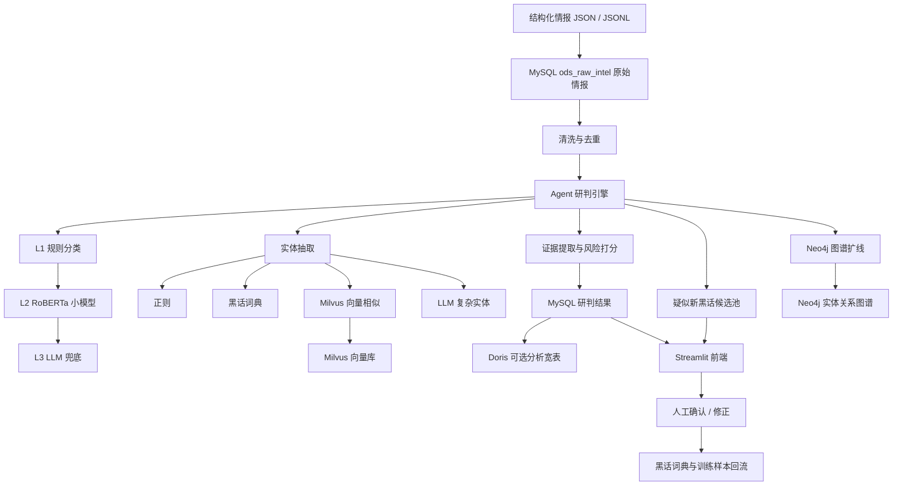

# BAGI 智能黑灰产情报研判与主动式可追溯反欺诈 Agent 平台

## 1. 项目定位

BAGI 是一个面向黑灰产情报治理的智能研判平台，目标是把来自 Telegram、贴吧、微博、知乎、论坛等渠道的高噪声文本情报，转化为可查询、可解释、可追溯、可沉淀的结构化风险知识。

项目的核心不是简单调用大模型生成报告，而是构建一条工程化闭环：

```text
结构化情报接收
  -> 文本清洗与去重
  -> 风险分类
  -> 实体抽取
  -> 黑话识别与归一
  -> 疑似新黑话发现
  -> 证据片段提取
  -> 风险打分
  -> 图谱扩线
  -> 持久化入库
  -> 前端研判与人工反馈
  -> 词典和样本回流
```

系统希望解决的真实痛点：

- 黑灰产内容体量大、来源多、格式脏。
- 黑话变化快，传统规则很难长期覆盖。
- 单条情报价值有限，需要通过账号、联系方式、链接、工具、黑话做关联扩线。
- 直接让大模型判断容易慢、贵、不可控、容易幻觉。
- 比赛演示需要清晰展示“系统为什么这么判断”，而不是只给一个结论。

因此 BAGI 采用“规则优先、小模型承接、大模型兜底、人工闭环修正”的架构。

## 2. 当前实现状态

当前项目已经实现一个可演示的纯 Python 版本：

- FastAPI：提供 API 服务和异步研判任务接口。
- Streamlit：提供研判工作台、情报池、线索库、关系扩线、黑话词典、批量黑话研判等页面。
- MySQL：保存原始情报、清洗结果、研判结果、实体、黑话词典、人工反馈、异步任务。
- Neo4j：保存情报和实体关系，用于关系扩线与团伙关联。
- Milvus：保存黑话和情报向量，用于语义相似检索。
- Doris：作为可选 OLAP 分析库，用于后续 ChatBI 或大屏统计增强。
- 本地 RoBERTa 分类器：作为 L2 小模型分类层。
- 本地 SentenceTransformer 向量模型：用于黑话相似匹配和 Milvus 检索。
- LLM：作为分类、实体抽取、证据解释中的兜底能力。

当前没有独立 Spring Boot 后端。比赛 MVP 以 Python 全栈完成，Java/Spring Boot 可作为后续工程化增强方向。

## 3. 技术架构



## 4. 目录结构

```text
BGI/
  agents/                 图谱扩线、报告摘要等 Agent 工具
  analyzer/               分类、实体抽取、证据提取、风险打分、状态机研判引擎
  api/                    FastAPI 服务
  cleaner/                文本清洗、去重相关逻辑
  collectors/             采集器代码，当前主要由搭档侧负责
  config/                 配置中心、风险规则
  data/                   本地数据、种子词典、模型目录
  docker/                 MySQL、Neo4j、Milvus、Doris 等容器配置
  scripts/                数据导入、模型训练、演示脚本
  storage/                MySQL、Neo4j、Milvus、Doris 访问层
  tests/                  单元测试
  ui/                     Streamlit 前端
  main.py                 命令行入口
  schema.py               项目枚举和基础数据模型
  README.md               当前唯一项目说明文档
```

## 5. 数据输入格式

搭档侧爬虫和清洗后，建议统一交付 JSONL，每行一条情报。示例：

```json
{
  "platform": "telegram",
  "content_raw": "抖音无人直播技术，全套教程+工具，包教包会。详情看主页，联系微信 douyin_pro888。工具下载 https://linktr.ee/douyin_pro",
  "content_type": "text",
  "source_url": "https://t.me/直播技术/24305904",
  "author_uid": "906341966",
  "author_username": "外挂脚本",
  "group_id": "直播技术",
  "collected_at": "2026-05-18T12:33:35",
  "metadata": {
    "keyword": "直播技术",
    "has_image": false,
    "has_video": false,
    "is_long_text": false,
    "message_id": 24305904
  }
}
```

进入系统后会映射为：

| 输入字段 | 入库字段 | 说明 |
|---|---|---|
| `platform` | `source_platform` | 来源平台 |
| `content_raw` | `content_raw` | 原始文本 |
| `source_url` | `source_url` | 原始链接 |
| `author_uid` | `author_id` | 作者账号ID |
| `author_username` | `author_name` | 作者昵称 |
| `collected_at` | `collect_time` | 采集时间 |
| `metadata` | `metadata` | 附加元数据 |

## 6. 核心研判流程

### 6.1 数据接收

入口：

- `storage/mysql_store.py`
- `insert_raw(item)`

作用：

将搭档侧交付的结构化 JSON 写入 `ods_raw_intel`。

输出：

- `raw_id`
- 原始情报状态：`RAW_COLLECTED`

### 6.2 清洗与去重

主要文件：

- `cleaner/pipeline.py`
- `cleaner/simhash_py.py`

处理内容：

- 去 HTML 标签。
- 全角半角归一。
- 噪声评分。
- SimHash 指纹计算。
- 重复或近重复内容识别。

示例：

```text
原始文本：
<div>高价收料!!! 加 V: test_wx888，跑分稳定</div>

清洗后：
高价收料 加V test_wx888 跑分稳定
```

结果写入：

- `dwd_clean_intel`

### 6.3 风险分类

主要文件：

- `analyzer/classifier.py`

分类采用三级级联：

```text
L1 规则层
  关键词、正则、风险短语命中

L2 小模型层
  本地 RoBERTa 文本分类器

L3 大模型兜底层
  DeepSeek 或兼容 OpenAI API 的 LLM
```

代码入口：

```python
classifier.classify(text, skip_llm=False)
```

输出示例：

```json
{
  "intent_label": "工具交易",
  "sub_label": "脚本/外挂",
  "confidence": 0.95,
  "method": "keyword"
}
```

说明：

- 如果规则命中，直接返回高置信度结果。
- 如果规则不命中，进入 RoBERTa 小模型。
- 如果小模型低置信度或不可用，再交给大模型。
- 如果用户选择“快速筛查”，会按单任务关闭 LLM，不影响其它并发任务。

### 6.4 实体抽取

主要文件：

- `analyzer/entity_extractor.py`

实体抽取采用四层级联：

```text
L1 正则抽取
  手机号、微信、QQ、Telegram、邮箱、URL、域名、IP、银行卡、钱包地址

L2 词典命中
  已知黑话、工具词、风险术语

L3 向量相似
  使用 SentenceTransformer + Milvus 发现黑话变体

L4 大模型抽取
  复杂工具、风险特征、疑似新黑话、隐晦账号关系
```

示例输入：

```text
抖音无人直播技术，全套教程+工具，联系微信 douyin_pro888
```

可能输出：

```json
[
  {
    "entity_type": "wechat",
    "entity_value": "douyin_pro888",
    "extraction_method": "regex"
  },
  {
    "entity_type": "tool",
    "entity_value": "无人直播工具",
    "extraction_method": "llm"
  },
  {
    "entity_type": "slang",
    "entity_value": "无人直播",
    "extraction_method": "dict"
  }
]
```

结果写入：

- `dwd_entity`
- Neo4j 实体节点
- Neo4j 关系边

### 6.5 疑似新黑话发现

这是当前项目的重要亮点。

当 LLM 或向量模型发现某个词像黑话，但它不在正式黑话词典中时，系统不会直接污染正式词典，而是写入候选池。

流程：

```text
模型发现疑似新黑话
  -> 生成候选词、建议释义、证据片段、发现原因、置信度
  -> 写入 dim_slang_dict，status=candidate
  -> 前端黑话词典页展示在“待审核候选”
  -> 人工选择“加入正式词典”或“忽略该候选”
```

候选输出示例：

```json
{
  "term": "白资",
  "suggested_meaning": "疑似指可用于实名注册或养号的账号资料",
  "risk_category": "账号黑产",
  "confidence": 0.73,
  "evidence": "白资大量出，接码稳定，走担保",
  "reason": "上下文同时出现交易、接码和担保语境",
  "source": "llm_candidate"
}
```

候选状态：

| 状态 | 含义 |
|---|---|
| `active` | 正式黑话词典 |
| `candidate` | 待人工审核 |
| `rejected` | 已忽略 |

相关文件：

- `analyzer/entity_extractor.py`
- `analyzer/state_machine.py`
- `storage/mysql_store.py`
- `ui/views/slang_dict.py`
- `ui/views/analysis_workbench.py`

### 6.6 证据片段提取

主要文件：

- `analyzer/evidence_extractor.py`

作用：

为风险结论提供可解释证据，而不是只给标签。

证据来源：

- 风险规则命中的文本片段。
- 实体周边上下文。
- LLM 对疑难文本的证据解释。

输出示例：

```json
{
  "text": "联系微信 douyin_pro888，工具下载 https://linktr.ee/douyin_pro",
  "risk_point": "站外导流与工具交易",
  "reason": "文本同时出现联系方式和工具下载链接",
  "method": "entity_context",
  "confidence": 0.82
}
```

### 6.7 风险打分

主要文件：

- `analyzer/risk_scorer.py`

风险分不是只看分类置信度，而是综合多个因素：

- 分类置信度。
- 联系方式实体。
- 外链或域名实体。
- 工具实体。
- 黑话命中。
- 图谱扩线命中。

输出：

```json
{
  "risk_score": 0.86,
  "risk_level": "critical"
}
```

### 6.8 图谱扩线

主要文件：

- `agents/graph_agent.py`
- `storage/neo4j_store.py`

Neo4j 用于分析不同情报之间是否共享关键线索。

节点类型：

| 节点 | 说明 |
|---|---|
| `Intel` | 情报节点 |
| `Account` | 微信、QQ、Telegram 等账号 |
| `Contact` | 手机号、邮箱、银行卡、钱包 |
| `Link` | URL、域名、IP |
| `Tool` | 工具、脚本、外挂 |
| `Slang` | 黑话 |

关系类型：

| 关系 | 说明 |
|---|---|
| `MENTIONS` | 情报提到了某个实体 |
| `PROMOTES` | 情报推广了链接或工具 |
| `USES_CONTACT` | 账号使用某个联系方式 |
| `CO_OCCURS` | 实体在同一条情报中共现 |
| `EXTRACTED_FROM` | 实体来源于某条情报 |

图谱页不再展示全量大图，而是以一个实体为中心，展示 1 到 2 跳关系，避免画面混乱。

## 7. 数据库设计

### 7.1 MySQL

MySQL 是系统主库，负责业务状态、结果持久化和人工反馈。

| 表名 | 中文说明 |
|---|---|
| `ods_raw_intel` | 原始情报表 |
| `dwd_clean_intel` | 清洗情报表 |
| `dwd_intel_analysis` | 情报研判结果表 |
| `dwd_entity` | 结构化线索表 |
| `dwd_entity_relation` | 线索关系表 |
| `dim_slang_dict` | 黑话词典与候选黑话池 |
| `ads_risk_case` | 风险案件聚合表 |
| `agent_report` | Agent 研判摘要表 |
| `annotation_log` | 人工反馈日志表 |
| `analysis_job` | 异步研判任务表 |

当前核心表已补充中文表注释和字段注释，方便在数据库管理工具中查看。

### 7.2 Neo4j

Neo4j 保存实体关系，用于扩线。

核心目的：

- 查找共享微信、手机号、域名、工具的情报。
- 根据共现关系发现疑似团伙。
- 为前端关系扩线页面提供子图数据。

### 7.3 Milvus

Milvus 保存向量数据。

集合：

| 集合 | 说明 |
|---|---|
| `slang_embeddings` | 黑话词向量，用于发现变体黑话 |
| `intel_embeddings` | 情报文本向量，用于相似情报检索 |

### 7.4 Doris

Doris 是可选增强组件。

定位：

- 作为 OLAP 分析宽表。
- 后续支撑 ChatBI。
- 支撑大屏统计、趋势查询、多维聚合。

当前主流程不依赖 Doris。MySQL、Neo4j、Milvus 是演示主链路。

## 8. API 设计

主要 API 位于：

- `api/server.py`

### 8.1 单条研判

```http
POST /internal/v1/agent/analyze
```

请求：

```json
{
  "raw_id": 10086,
  "platform": "telegram",
  "text": "接码平台推荐，专业下款通道，联系 TG: @black_channel",
  "options": {
    "enable_graph_expand": true,
    "enable_report": true,
    "enable_llm": true
  }
}
```

响应：

```json
{
  "raw_id": 10086,
  "risk_label": "工具交易",
  "risk_sub_label": "接码平台推广",
  "risk_score": 0.86,
  "risk_level": "high",
  "evidence_spans": [],
  "entities": [],
  "slang_terms": [],
  "new_slang_candidates": [],
  "graph_result": {},
  "agent_summary": "",
  "disposal_advice": []
}
```

说明：

- API 失败时会返回明确错误，不再伪装成空结果成功。
- `enable_llm` 是单任务参数，不会影响其它并发任务。

### 8.2 异步研判任务

```http
POST /api/analysis/jobs
GET  /api/analysis/jobs/{job_id}
POST /api/analysis/jobs/batch
```

用途：

- 前端提交任务后不阻塞页面。
- 批量黑话研判可以并发处理多条数据。
- 页面可以轮询任务状态。

### 8.3 黑话候选审核

```http
GET  /api/slang/candidates
POST /api/slang/candidates/approve
POST /api/slang/candidates/reject
```

用途：

- 查看模型发现的疑似新黑话。
- 人工确认后加入正式词典。
- 人工判断误报后标记为忽略。

## 9. 前端页面

前端使用 Streamlit。

### 9.1 研判工作台

文件：

- `ui/views/analysis_workbench.py`

用途：

- 选择单条情报。
- 选择研判模式。
- 展示风险结论、证据片段、实体线索、黑话解释、疑似新黑话、图谱扩线结果、处置建议。
- 支持人工修正。

研判模式：

| 模式 | LLM | 图谱 | 适用场景 |
|---|---|---|---|
| 快速筛查 | 关闭 | 关闭 | 大批量快速处理 |
| 关系扩线 | 关闭 | 开启 | 关注账号、联系方式、团伙关联 |
| 深度复核 | 开启 | 开启 | 少量疑难样本、新黑话发现 |

### 9.2 批量黑话研判

文件：

- `ui/views/slang_workbench.py`

用途：

- 一次粘贴多条黑话或黑产广告。
- 后台并发提交任务。
- 完成一条即可查看一条。
- 疑似新黑话会进入候选池。

### 9.3 黑话词典

文件：

- `ui/views/slang_dict.py`

用途：

- 浏览正式黑话词典。
- 审核候选黑话。
- 忽略误报候选词。

### 9.4 情报池

文件：

- `ui/views/intel_list.py`

用途：

- 浏览已导入情报。
- 按平台、风险类型、处理状态筛选。
- 查看风险结论和判定方式。

### 9.5 线索库

文件：

- `ui/views/entities.py`

用途：

- 查看抽取出的账号、链接、黑话、工具等线索。
- 按线索类型筛选。
- 支持搜索线索值和上下文。

### 9.6 关系扩线

文件：

- `ui/views/graph.py`

用途：

- 以实体为中心查询 Neo4j。
- 展示 1 到 2 跳子图。
- 辅助发现共享联系方式、共享域名、共享工具的团伙线索。

## 10. Agent 的智能性体现

项目不是单纯流水线，智能性体现在以下几点：

### 10.1 自适应工具选择

状态机 Agent 会根据当前结果决定是否调用：

- 图谱扩线工具。
- 黑话归一工具。
- 相似情报去重工具。
- 证据提取工具。

如果没有可扩线实体，图谱查询会跳过。

如果没有黑话实体，黑话归一会跳过。

如果分类置信度太低，相似去重会跳过。

### 10.2 分层降本

系统不是所有数据都调用大模型：

- 规则命中则直接返回。
- 小模型高置信度则不调用 LLM。
- 实体抽取如果规则和词典已经命中足够高价值实体，会跳过 LLM。
- 快速筛查模式会按单任务关闭 LLM。

这可以提高速度，降低成本，也方便答辩时解释工程可落地性。

### 10.3 新黑话发现闭环

当模型发现疑似新黑话时，不直接污染词典，而是进入候选池，由人工确认。

这让系统具备持续成长能力：

```text
未知黑话
  -> 模型发现
  -> 人工确认
  -> 正式词典
  -> 后续规则/词典快速命中
```

这是比赛中非常值得强调的亮点。

## 11. 运行方式

### 11.1 启动基础设施

```bash
docker compose -f docker/docker-compose.yml up -d
```

说明：

- MySQL 是主流程必需。
- Neo4j、Milvus 用于扩线和向量检索。
- Doris 是可选增强。

### 11.2 初始化数据库

```bash
python main.py init-db
```

会执行：

- 建表。
- 幂等迁移。
- 中文表注释和字段注释补齐。
- 黑话词典种子数据导入。

### 11.3 启动前端

```bash
python main.py ui
```

访问：

```text
http://localhost:8501
```

### 11.4 启动 API

```bash
python main.py api
```

### 11.5 导入搭档 JSONL

```bash
python scripts/importers/import_partner_jsonl.py --file data/partner.jsonl
```

### 11.6 运行演示数据

```bash
python scripts/demo/demo_one.py
```

### 11.7 运行测试

```bash
python -m pytest tests -q
```

当前验证结果：

```text
41 passed
```

## 12. 当前已解决的关键问题

### 12.1 前端阻塞问题

已引入异步任务表 `analysis_job` 和后台线程池。

前端可以提交任务后继续操作，不必等待当前研判完成。

### 12.2 LLM 全局串扰问题

已修复。

`enable_llm` 现在是单任务参数，不会因为一个任务选择快速筛查而影响其它深度复核任务。

### 12.3 API 静默失败问题

已修复。

研判 API 失败时返回明确错误，不再返回空结果伪装成功。

### 12.4 模型文件污染仓库问题

已处理。

`data/models` 保留本地文件，但不进入 Git 跟踪。

### 12.5 前端字段名不友好问题

已处理。

新增 `ui/labels.py`，把数据库字段和枚举值映射成中文业务表达。

### 12.6 数据库缺少中文注释问题

已处理。

核心表和关键字段已增加中文 COMMENT。

### 12.7 黑话词典缺少增长闭环

已处理。

模型发现的新黑话会进入候选池，人工确认后进入正式词典。

## 13. 当前不足与后续优化

### 13.1 代码结构仍可继续拆分

当前两个文件仍偏大：

- `storage/mysql_store.py`
- `analyzer/state_machine.py`

后续建议拆成：

```text
storage/mysql/
  schema.py
  raw_repo.py
  analysis_repo.py
  entity_repo.py
  slang_repo.py
  job_repo.py
  annotation_repo.py

analyzer/
  agent_engine.py
  agent_tools.py
  persistence.py
  tracing.py
```

### 13.2 OCR/ASR 仍依赖上游

当前主链路以文本为主。

如果搭档侧能稳定提供 OCR/ASR 结果，可以进一步增强多模态能力。

### 13.3 Doris ChatBI 尚未作为主演示能力

Doris 已作为可选分析库接入方向，但自然语言转 SQL 的 ChatBI 还不是当前主链路。

比赛演示建议先突出：

- 研判工作台。
- 批量黑话研判。
- 新黑话候选池。
- 关系扩线。

### 13.4 小模型效果依赖训练质量

RoBERTa 分类器已经作为 L2 层存在，但实际效果取决于训练样本质量。

后续可以将人工修正样本持续回流，提升小模型覆盖率，减少 LLM 调用。

## 14. 比赛演示建议

### 场景一：单条情报研判

输入：

```text
抖音无人直播技术，全套教程+工具，包教包会。详情看主页，联系微信 douyin_pro888。
```

展示：

- 风险分类为工具交易或直播违规。
- 抽取微信号。
- 抽取工具或黑话。
- 展示证据片段。
- 给出处置建议。

### 场景二：疑似新黑话发现

输入：

```text
白资大量出，接码稳定，走担保，量大优惠。
```

展示：

- 系统发现“白资”为疑似新黑话。
- 给出模型建议释义。
- 展示证据和原因。
- 人工点击加入正式词典。
- 再次研判时词典可直接命中。

### 场景三：关系扩线

输入一个微信号、Telegram 账号、手机号或域名。

展示：

- 该实体关联的历史情报。
- 共享联系方式或共享域名。
- 疑似团伙关系。

### 场景四：批量黑话研判

一次粘贴多条情报。

展示：

- 后台异步任务。
- 多条任务并发执行。
- 完成一条即可查看一条结果。
- 页面不会卡死。

## 15. 一句话总结

BAGI 当前已经形成一个可演示、可解释、可追溯、可持续学习的黑灰产情报研判 Agent 平台。它的核心价值不是“用大模型写报告”，而是通过规则、小模型、向量检索、大模型和人工反馈闭环，把高噪声黑灰产文本转化为结构化线索、风险证据、关系图谱和可增长的黑话知识库。
