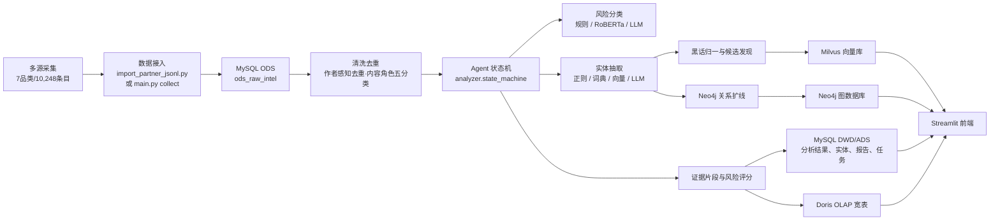
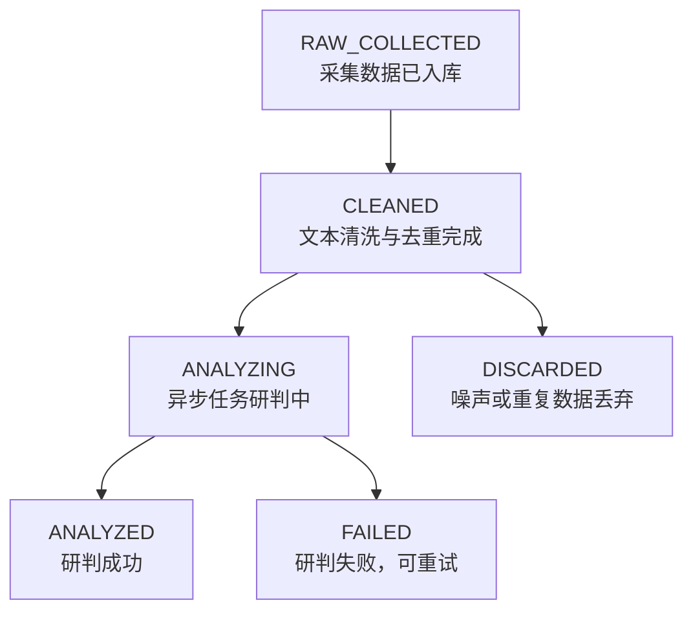
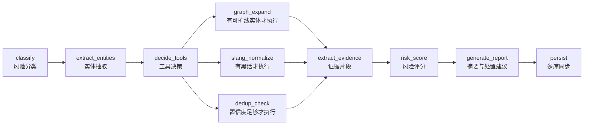
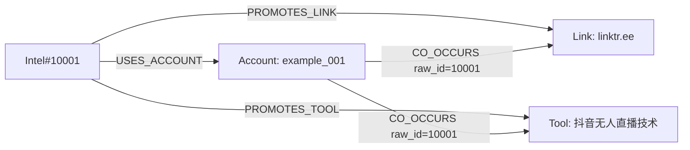

# BGI 智能黑灰产情报研判 Agent

BGI 是一个面向比赛演示和反欺诈业务验证的黑灰产情报分析系统。它从多源采集开始，完成数据接入 → 清洗去重(作者感知去重·内容角色五分类) → 风险意图分类 → 实体抽取 → 黑话归一 → 新黑话候选发现 → 证据片段提取 → 风险评分 → 关系扩线 → 结构化入库 → 轻量 ChatBI 态势问答。

当前版本的核心定位很明确：**把散落的黑灰产文本情报，自动变成可查询、可扩线、可复核的结构化线索库**。

数据流程：原始数据导入 → UI清洗页面手动批量清洗 → ods_raw_intel → 自动研判 → 实体提取入库。各环节拆分为独立页面仅为展示处理过程。

## 1. 项目边界

本项目覆盖采集 → 分析 → 展示的完整链路。

- 采集层：**7 品类已打通** — 内容平台（微博/知乎/小红书/抖音/贴吧）+ 二手/众包（闲鱼）+ 社交IM（QQ群），HTTP + Playwright + WebSocket 多模式，产出统一 IntelItem 格式。支持评论采集、图片/封面 URL 提取、QQ群双模式采集（被动监听+主动拉取历史）。**Telegram 已于 v4.2 停用。**
12	- 🆕 **主动情报收集**: AI人物钓鱼 Skill（Persona Engine），LLM驱动虚拟人物对话，安全护栏保障合规。
13	
- 分析层：接收结构化数据，写入 MySQL，执行清洗、分类、实体抽取、黑话研判、图谱扩线、Doris 聚合和前端展示。
- OCR/ASR：代码结构允许接入，图文 OCR 管道已实现（PaddleOCR）。
- Java/Spring Boot：当前项目没有 Java 后端，控制面由 Python + FastAPI + Streamlit 承担。

## 2. 当前能力总览

| 模块 | 当前状态 | 说明 |
|---|---:|---|
| **数据采集** | **已实现** | **7品类打通: 内容平台(5)+二手/众包(闲鱼)+社交IM(QQ群)+人物钓鱼(Persona)，纯HTTP+Playwright+WebSocket多模式** |
| 🆕 **主动情报 (Persona)** | **已实现** | **3个AI人物Profile，LLM驱动钓鱼对话，安全护栏保障合规，Phase 1: LLM模拟测试** |
| 示例数据 | 已提供 | `examples/` 含 7 品类 10,248 条真实黑灰产样本（含评论/答案/图片） |
| 结构化数据接入 | 已实现 | `scripts/importers/import_partner_jsonl.py` 支持 JSONL 导入、字段校验、去重入库 |
| 清洗去重 | 已实现 | 6步零LLM管道 — Emoji语义翻译 + 平台感知过滤 + 文本规范化 + **作者感知SimHash去重**(同作者+相似=重复,不同作者+相似=情报保留) + 噪声评分(短文本情报免罚) + 优先级标记。新增: MEDIA_ONLY保护、内容角色五分类(actor/media/police/victim/unknown)、自适应阈值(<30字→0, ≥80字→3) |
| 风险分类 | 已实现 | L1 规则优先，L2 RoBERTa 接口预留，L3 LLM 兜底，支持降级 |
| 实体抽取 | 已实现 | 正则、黑话词典、Milvus 相似检索、LLM 结构化抽取四级级联 |
| 黑话归一 | 已实现 | 命中 `dim_slang_dict` 后输出标准释义；模型发现的新词进入候选黑话 |
| 证据片段 | 已实现 | 规则证据、实体上下文、LLM 证据三通道 |
| 风险评分 | 已实现 | 综合分类置信度、实体强度、证据数量、图谱扩线等因素 |
| 异步研判 | 已实现 | 前端提交任务后后台线程池处理，页面不再被单条数据阻塞 |
| Neo4j 图谱 | 已实现 | 将情报、账号、联系方式、链接、工具、黑话等保存为节点和关系 |
| Milvus 向量库 | 已实现 | 黑话相似检索、历史情报相似检索 |
| Doris OLAP | 已实现 | 研判结果写入宽表，用于趋势聚合和 ChatBI 数据底座 |
| Streamlit 前端 | 已实现 | 总览/ChatBI、研判工作台、情报池、知识库、系统状态 |
| 轻量 ChatBI | 已实现 | 白名单指标问答，不让大模型自由生成 SQL |
| 小模型训练 | 已提供脚本 | `scripts/modeling/train_roberta.py` 可训练 RoBERTa；是否生效取决于本地模型是否训练完成 |

## 3. 技术架构



核心原则：

- **规则优先**：能用规则、词典、向量解决的，不优先调用大模型。
- **LLM 兜底**：黑话变体、复杂语义和证据解释由 LLM 补足。
- **事实落库**：LLM 输出必须沉淀为结构化字段，前端展示以数据库事实为准。
- **图谱不抢跑**：Neo4j 扩线必须等实体抽取完成后才执行，因为扩线依赖账号、联系方式、链接、工具等实体。
- **ChatBI 不自由写 SQL**：当前采用白名单问题到固定 SQL 的方式，降低幻觉和误查风险。

## 4. 主流程



主流水线分三层：

| 层级 | 作用 | 主要文件 |
|---|---|---|
| 第一层：主流水线 | 数据接入、清洗去重、分类、实体抽取、结构化入库 | `scripts/importers/`、`cleaner/`、`analyzer/`、`storage/mysql_store.py` |
| 第二层：研判增强 | 黑话归一、新黑话候选、风险打分、证据片段、关系扩线 | `analyzer/state_machine.py`、`analyzer/evidence_extractor.py`、`analyzer/risk_scorer.py`、`agents/graph_agent.py` |
| 第三层：展示增强 | 态势看板、批量队列、知识库、Doris 聚合、轻量问答 | `ui/`、`storage/doris_store.py` |

## 5. 一条数据如何被处理

数据示例：

```json
{
  "platform": "zhihu",
  "content_raw": "抖音无人直播技术，全套教程+工具，包教包会。详情看主页，联系微信 example_001。工具下载 https://example.com/tools",
  "content_type": "text",
  "source_url": "https://www.zhihu.com/question/123456789",
  "author_uid": "10000001",
  "author_username": "外挂脚本",
  "group_id": "直播技术",
  "collected_at": "2026-05-18T12:33:35",
  "metadata": {
    "keyword": "直播技术",
    "has_image": false,
    "has_video": false,
    "is_long_text": false,
    "message_id": 10001
  }
}
```

### 5.1 接收入库

脚本：`scripts/importers/import_partner_jsonl.py`

输入：一行一个 JSON 对象的 JSONL 文件。

处理逻辑：

1. 校验必填字段：`platform`、`content_raw`、`content_type`、`collected_at`。
2. 将外部字段映射为系统字段，例如 `author_uid -> author_id`、`author_username -> author_name`。
3. 按 `source_platform + source_url` 或 `message_id` 做幂等检查。
4. 写入 MySQL `ods_raw_intel`，状态为 `RAW_COLLECTED`。

落库后的关键字段：

```json
{
  "source_platform": "zhihu",
  "source_channel": "直播技术",
  "source_url": "https://www.zhihu.com/question/123456789",
  "author_id": "10000001",
  "author_name": "外挂脚本",
  "content_raw": "抖音无人直播技术，全套教程+工具，包教包会。详情看主页，联系微信 example_001。工具下载 https://example.com/tools",
  "raw_status": "RAW_COLLECTED"
}
```

### 5.2 清洗去重

核心文件：`cleaner/pipeline.py`

**6步零LLM清洗管道**：

```
原始文本
  ├─ Step 0: Emoji语义翻译 → 100+映射，8大语义类别，追加式翻译
  ├─ Step 1: 平台感知过滤 → 7平台专属规则 + 通用去噪 + 关键词误匹配检测(刷单≠刷题本)
  ├─ Step 2: 文本规范化   → HTML/Unicode/零宽字符/全半角/URL简化
  ├─ Step 3: 作者感知去重 ⭐ → 同作者+相似=DUPLICATE(丢弃) | 不同作者+相似=SIMILAR(保留)
  │           自适应阈值: <30字→0, 30-79字→1, ≥80字→3
  ├─ Step 4: 噪声评分     → 12维度评分(0-1)，短文本含情报关键词免罚
  └─ Step 5: 优先级标记   → 36个高危关键词→HIGH/NORMAL
```

**核心创新 — 作者感知去重**：

传统SimHash看到相同内容就判重丢弃。但在情报语境中，同一内容被不同人发布本身就是情报信号——多人发同一广告说明供应活跃，多家媒体转同一新闻说明议题扩散。

| 场景 | 旧行为 | 新行为 |
|------|--------|----------|
| 同一新闻6家媒体转发 | 保留1条删5条 → **情报丢失** | 1条CLEANED + 5条SIMILAR → **全部保留** |
| 同一卖家重复发同一广告 | 判重丢弃 | 判重丢弃（SAME_AUTHOR） |
| QQ群 [image] 消息 | 判噪声丢弃 | **MEDIA_ONLY** → 保留待媒体分析 |
| 短消息”寻海外卡商 日跑5w”(16字) | 因”文本较短”被罚分 | 检测到情报关键词→**免罚** |

**新增输出状态**：

| 状态 | 含义 | 下游处理 |
|------|------|---------|
| `CLEANED` | 清洗通过，非重复 | 进入分析管道 |
| `SIMILAR` | 不同作者相似内容 | 保留，标记`similar_to`跨作者引用 |
| `MEDIA_ONLY` | 纯图片/视频占位 | 保留，标记待媒体分析 |
| `DISCARDED` | 真正噪声或同作者重复 | 不进入分析 |

**内容角色五分类**（零LLM调用，基于关键词+发布者账号分析）：

| 角色 | 含义 | 检测信号 |
|------|------|---------|
| `actor` | 疑似灰产从业者 | “出号””接码””私我””懂的来” |
| `victim` | 受害者自述 | “被骗了””逾期””催收””求助” |
| `media` | 媒体报道 | 账号含”新闻””财经””传媒” |
| `police` | 警方/反诈 | “警方””公安””抓获””反诈” |
| `unknown` | 无法判断 | — |

典型输出：

```json
{
  “text”: “抖音无人直播技术，全套教程+工具，包教包会。联系微信 example_001”,
  “simhash”: “0x8f4a...”,
  “md5”: “a1b2c3...”,
  “is_duplicate”: false,
  “is_similar”: false,
  “is_media_only”: false,
  “content_role”: “actor”,
  “is_noise”: false,
  “noise_score”: 0.05,
  “priority”: “high”,
  “should_discard”: false,
  “status”: “CLEANED”
}
```

### 5.3 Agent 研判状态机

核心入口：

- `analyzer/engine.py`
- `analyzer/state_machine.py`

执行顺序：



这里的“智能体”不是四个分支无脑并行，而是一个状态机 Agent：先分类、再抽实体，然后根据当前状态决定是否调用图谱扩线、黑话归一和相似检索。

### 5.4 风险分类

核心文件：`analyzer/classifier.py`

三级级联：

1. L1 规则层：从 `config/risk_rules.yaml` 加载关键词、正则、组合规则；命中后直接输出高置信度分类。
2. L2 小模型层：加载 `settings.roberta_model_path` 指向的 RoBERTa/MacBERT 类文本分类模型；未训练或加载失败时自动跳过。
3. L3 LLM 层：当前两层无法判断时调用大模型，要求返回固定 JSON。

典型结果：

```json
{
  "intent_label": "直播违规",
  "sub_label": "无人直播",
  "confidence": 0.86,
  "method": "keyword 或 llm"
}
```

说明：当前代码已经有 RoBERTa 训练脚本，但是否真正进入 L2，取决于本地 `data/models/roberta_classifier` 是否包含完整可加载模型。

### 5.5 实体抽取

核心文件：`analyzer/entity_extractor.py`

四级级联：

1. L1 正则：手机号、微信、QQ、Telegram、邮箱、URL、域名、IP、银行卡、支付宝、虚拟币钱包。
2. L2 词典：从 MySQL `dim_slang_dict` 加载已知黑话。
3. L3 向量：切分疑似短语，向 Milvus `slang_embeddings` 检索相似黑话。
4. L4 LLM：补充复杂工具名、风险标签、隐晦黑话、特征描述。

示例文本可抽取：

```json
[
  {
    "entity_type": "wechat",
    "entity_value": "example_001",
    "extraction_method": "regex",
    "context": "详情看主页，联系微信 example_001。工具下载"
  },
  {
    "entity_type": "url",
    "entity_value": "https://example.com/tools",
    "extraction_method": "regex"
  },
  {
    "entity_type": "domain",
    "entity_value": "linktr.ee",
    "extraction_method": "regex"
  },
  {
    "entity_type": "tool",
    "entity_value": "抖音无人直播技术",
    "extraction_method": "llm"
  }
]
```

### 5.6 黑话归一与新黑话候选

黑话处理分两类：

- 已知黑话：命中 `dim_slang_dict` 后返回标准释义。
- 疑似新黑话：由 embedding 或 LLM 发现，但不在 active 词典中，会写入候选状态，供人工确认。

候选黑话会进入：

- `dim_slang_dict.status = candidate`
- 前端“知识库 / 黑话词典”中等待确认

这一步是比赛里比较关键的亮点：系统不是只会识别已有规则，还能把疑似新词沉淀成词典演化入口。

### 5.7 证据片段与风险评分

核心文件：

- `analyzer/evidence_extractor.py`
- `analyzer/risk_scorer.py`

证据片段用于说明“为什么系统这么判”。例如：

```json
[
  {
    "text": "联系微信 example_001",
    "risk_point": "站外联系方式",
    "reason": "出现明确导流账号",
    "confidence": 0.95,
    "method": "entity_context"
  },
  {
    "text": "工具下载 https://example.com/tools",
    "risk_point": "外链工具分发",
    "reason": "出现工具下载链接",
    "confidence": 0.92,
    "method": "rule"
  }
]
```

风险评分会综合：

- 分类置信度
- 高价值实体数量
- 黑话数量
- 外链和联系方式强度
- 证据片段数量
- 是否命中图谱扩线

典型输出：

```json
{
  "risk_score": 0.82,
  "risk_level": "high"
}
```

### 5.8 Neo4j 如何保存

核心文件：`storage/neo4j_store.py`

节点类型：

| 节点 | 含义 | 示例 |
|---|---|---|
| `Intel` | 一条原始情报 | `raw_id=10001` |
| `Account` | 黑灰产账号 | 微信、QQ、Telegram、支付宝 |
| `Contact` | 联系或收款载体 | 手机号、邮箱、银行卡 |
| `Link` | 链接资产 | URL、域名、IP |
| `Tool` | 工具资产 | 脚本、外挂、接码平台 |
| `Slang` | 黑话术语 | 跑分、料子、接码 |
| `Wallet` | 虚拟币钱包 | TRC20、ETH 地址 |

关系类型：

| 关系 | 含义 |
|---|---|
| `USES_ACCOUNT` | 情报提到了某个账号 |
| `USES_CONTACT` | 情报提到了手机号、邮箱、银行卡、钱包等联系方式 |
| `PROMOTES_LINK` | 情报推广了某个链接、域名或 IP |
| `PROMOTES_TOOL` | 情报推广了工具、脚本或服务 |
| `USES_SLANG` | 情报使用了某个黑话 |
| `CO_OCCURS` | 两个实体在同一条情报中共现，或共享联系人后形成关联 |

示例图谱结构：



图谱扩线的目的不是展示一张巨大乱图，而是回答三个问题：

1. 当前账号或链接以前是否出现过？
2. 它是否和其他账号共享联系方式、链接、工具？
3. 是否能形成疑似团伙或作恶链路？

### 5.9 多库同步

研判完成后，系统会同步写入：

| 存储 | 作用 |
|---|---|
| MySQL | 主业务库，保存原始情报、清洗结果、研判结果、实体、候选黑话、任务状态 |
| Neo4j | 保存实体关系，用于扩线和团伙关联 |
| Milvus | 保存黑话和情报向量，用于相似检索 |
| Doris | 保存分析宽表，用于趋势聚合和 ChatBI |

如果 Doris 或 Milvus 临时不可用，主流程会尽量降级，不让前端整体崩溃；连接状态可在“系统状态”页面查看。

## 6. 数据库设计

### 6.1 MySQL

MySQL 是系统主库。

| 表 | 用途 |
|---|---|
| `ods_raw_intel` | 原始情报表，保存多源采集的结构化数据和处理状态 |
| `dwd_clean_intel` | 清洗结果表，保存 clean_text、simhash、去重状态 |
| `dwd_intel_analysis` | 研判结果表，保存风险分类、评分、证据、摘要 |
| `dwd_entity` | 实体库，保存账号、链接、黑话、工具等 |
| `dwd_entity_relation` | 实体关系表，用于 MySQL 侧轻量关系查询 |
| `dim_slang_dict` | 黑话词典，包含 active/candidate/deprecated 状态 |
| `ads_risk_case` | 风险案件聚合表，保存疑似团伙或案件级摘要 |
| `agent_report` | Agent 摘要、证据、处置建议归档 |
| `annotation_log` | 人工修正日志，用于 HITL 闭环 |
| `analysis_job` | 异步研判任务表，保存进度、状态、错误信息 |

### 6.2 Neo4j

Neo4j 用于关系扩线，不承担主数据存储。核心价值是发现“共享账号、共享联系方式、共享域名、共享工具”的关联。

### 6.3 Milvus

Milvus 当前有两个集合：

- `slang_embeddings`：黑话词向量，用于发现变体黑话。
- `intel_embeddings`：情报文本向量，用于相似情报检索和去重增强。

### 6.4 Doris

Doris 通过 MySQL 协议连接，默认端口是 `9030`。

核心宽表：

- `bagi_olap.intel_analysis_wide`

它保存一条情报研判后的宽字段，例如风险类型、风险等级、实体数量、黑话数量、证据数量、图谱扩线摘要、处置建议等。前端趋势图和 ChatBI 会优先使用 Doris；如果 Doris 不可用，部分统计会回退到 MySQL。

## 7. 前端功能

前端入口：`python main.py ui`

当前前端有 5 个页面。

| 页面 | 功能 |
|---|---|
| 总览 / ChatBI | 查看接收总量、待研判、研判中、已研判、高危情报、候选黑话；查看风险分布、趋势、近期情报；使用轻量 ChatBI 问答 |
| 研判工作台 | 选择或输入一条情报，提交异步研判任务，查看风险分类、实体、证据、黑话、扩线结果 |
| 情报池 | 查看全部情报，按状态筛选，批量提交待研判数据 |
| 知识库 | 查看实体库、黑话词典、候选黑话和关系扩线入口 |
| 系统状态 | 查看 MySQL、Neo4j、Milvus、Doris 实时连接状态和错误信息 |

### 7.1 轻量 ChatBI

当前 ChatBI 不是自由 Text-to-SQL，而是“自然语言问题 -> 白名单指标查询”。

支持的问题类型：

- 当前风险类型分布怎么样？
- 哪个平台高危情报最多？
- 最近 30 天热门黑话有哪些？
- 给我 10 条高危典型样本。
- 当前待研判队列还有多少？
- 上周贴吧哪个风险分类最活跃？

这样做的好处：

- 稳定，适合比赛演示。
- 不会让大模型编造表名、字段名或 SQL。
- 查询口径固定，结果可复现。

## 8. API 接口

启动 API：

```bash
python main.py api
```

核心接口：

| 方法 | 路径 | 作用 |
|---|---|---|
| `GET` | `/health` | 健康检查 |
| `GET` | `/api/stats` | 看板统计 |
| `GET` | `/api/intel` | 情报列表 |
| `GET` | `/api/intel/{raw_id}` | 单条情报详情 |
| `GET` | `/api/entities` | 实体列表 |
| `GET` | `/api/entities/{entity_id}/graph` | 查询实体周边图谱 |
| `GET` | `/api/slang` | 黑话词典 |
| `POST` | `/internal/v1/agent/analyze` | 同步研判一条情报 |
| `POST` | `/api/analysis/jobs` | 异步提交一条研判任务 |
| `POST` | `/api/analysis/jobs/batch` | 批量提交研判任务 |
| `GET` | `/api/analysis/jobs/{job_id}` | 查询任务进度 |

异步任务接口适合前端批量处理，避免单条研判阻塞页面。

## 9. 命令速查

进入项目目录：

```bash
cd /path/to/BGI
```

安装依赖：

```bash
pip install -r requirements.txt
```

启动基础设施：

```bash
docker compose -f docker/docker-compose.yml up -d
# 如需 OLAP 分析（Doris），需能拉取 Docker Hub 镜像：
# docker compose -f docker/docker-compose.yml --profile olap up -d
```

初始化数据库：

```bash
python main.py init-db --reset    # --reset: 清空全部数据从零开始（答辩推荐）
python main.py init-db            # 不加 --reset: 保留已有数据，增量迁移
```

导入 JSONL 数据：

```bash
python scripts/importers/import_partner_jsonl.py data/partner/demo.jsonl --status RAW_COLLECTED
```

清洗：

```bash
python main.py clean --limit 500
```

命令行批量研判：

```bash
python main.py analyze --limit 200
```

启动前端：

```bash
python main.py ui
```

启动 API：

```bash
python main.py api --host 0.0.0.0 --port 8000
```

运行测试：

```bash
python -m pytest tests -q
```

AI人物钓鱼：

```bash
python main.py persona list                                                       # 列出可用人物
python main.py persona run -p ecommerce_buyer -t "platform:uid:name:context"      # 单目标对话
python main.py persona run-batch -p ecommerce_buyer -f targets.json -o results.json  # 批量对话
```

训练 RoBERTa 分类模型：

```bash
python scripts/modeling/train_roberta.py --epochs 3
```

## 10. 配置说明

主要配置在 `.env` 和 `config/settings.py`。

常用环境变量：

```env
BGI_MYSQL_HOST=localhost
BGI_MYSQL_PORT=3306
BGI_MYSQL_USER=bagi
BGI_MYSQL_PASSWORD=bagi2026pass
BGI_MYSQL_DATABASE=bagi_intel

BGI_NEO4J_URI=bolt://localhost:7687
BGI_NEO4J_USER=neo4j
BGI_NEO4J_PASSWORD=bagi2026neo4j

BGI_MILVUS_HOST=localhost
BGI_MILVUS_PORT=19530

BGI_DORIS_ENABLED=true
BGI_DORIS_HOST=localhost
BGI_DORIS_PORT=9030
BGI_DORIS_USER=root
BGI_DORIS_PASSWORD=
BGI_DORIS_DATABASE=bagi_olap

BGI_LLM_API_KEY=你的 API Key
BGI_LLM_API_BASE=https://api.deepseek.com/v1
BGI_LLM_MODEL=deepseek-chat
```

Doris 注意事项：

- DataGrip 或 JDBC 连接 Doris 时使用 MySQL 驱动。
- 端口使用 `9030`，不是 Web 控制台端口 `8030`。
- 如果出现 `Can not read response from server`，通常是 FE 还没完全 ready、BE 未注册成功、或客户端连接到了错误端口。

## 11. 项目目录

```text
BGI/
├── agents/                  # 图谱扩线、报告摘要等 Agent 辅助模块
├── analyzer/                # 分类、实体抽取、证据、评分、状态机、异步 worker
├── api/                     # FastAPI 接口
├── cleaner/                 # Emoji翻译·平台过滤·作者感知去重·噪声评分·内容角色分类
├── collectors/              # 多源数据采集层（7品类已打通，10 Spider + 7 Collector）
├── config/                  # 配置与风险规则
├── data/                    # 模型、词典、样例数据
├── docker/                  # MySQL、Neo4j、Milvus、MinIO、Doris 编排
├── scripts/
│   ├── crawl/               # 采集 smoke 测试
│   ├── demo/                # 单条演示脚本
│   ├── importers/           # JSONL、黑话词典导入
│   └── modeling/            # RoBERTa 训练脚本
├── storage/                 # MySQL、Neo4j、Milvus、Doris 访问层
├── tests/                   # 单元测试
├── ui/                      # Streamlit 前端
├── main.py                  # CLI 入口
├── schema.py                # 共享枚举和数据结构
└── README.md                # 当前唯一项目说明文档
```

## 12. 比赛演示建议

推荐演示顺序：

1. 在”情报池”展示多平台情报，说明数据源已经统一进入 `RAW_COLLECTED`。
2. 批量提交 10 到 20 条待研判情报，展示异步任务不会卡住页面。
3. 在“研判工作台”打开一条典型黑话情报，展示风险分类、实体、证据、黑话归一、候选新黑话。
4. 在“知识库”查看实体和候选黑话，说明系统具备数据飞轮和人工复核入口。
5. 在“总览 / ChatBI”问“哪个平台高危情报最多”“最近 30 天热门黑话有哪些”，展示 Doris/MySQL 事实聚合。
6. 在“系统状态”展示 MySQL、Neo4j、Milvus、Doris 都在线，证明工程完整性。

## 13. 当前不足与下一步

| 问题 | 影响 | 建议 |
|---|---|---|
| L2 小模型未必已训练完成 | 大量规则外样本会落到 LLM，速度和成本受影响 | 使用 4090 训练 RoBERTa/MacBERT，并把验证集 F1 写入答辩材料 |
| MEDIA_ONLY 消息缺乏后续处理 | QQ群[image]/[视频]占位符被保留但无法分析内容 | 接入PaddleOCR管道处理图片类MEDIA_ONLY消息 |
| OCR/ASR 不是当前主链路 | 图片、语音黑话无法完整覆盖 | 后续可将 OCR/ASR 文本作为 `metadata.ocr_text/asr_text` 或单独字段交付 |
| 候选黑话需要更强 HITL | 新词可以发现，但人工确认流程还可以更顺 | 前端增加”通过/驳回/编辑释义”后自动刷新词典和 Milvus |
| 图谱扩线仍偏数据驱动 | 小样本时图谱冲击力有限 | 准备一组共享微信、手机号、域名的演示数据，突出团伙关联 |
| Doris 与 MySQL 可能存在历史不同步 | 重跑或中断后宽表计数可能不一致 | 增加一键 Doris 重建脚本，从 MySQL 最新研判结果回灌宽表 |
| 评测指标还不够完整 | 答辩时难证明”效果好” | 增加分类准确率、实体抽取准确率、平均研判耗时、LLM 调用比例等指标看板 |

## 14. 一句话总结

BGI 当前已经覆盖课题要求的主线：**情报采集接入 -> 智能清洗 -> 意图分类 -> 实体抽取**，并在此基础上扩展了黑话归一、候选新词、图谱扩线、异步研判、Doris 聚合和轻量 ChatBI。下一阶段最值得投入的是小模型训练、候选黑话 HITL、Doris 重建脚本和比赛演示数据集。
